# Session Service

On-prem service implementation with minimal cloud dependencies.

## Package Selection Rationale

For an on-prem service, these four packages usually show up together because they cover the "boring but necessary" platform pieces: HTTP routing, session/request state, caching/locking, and stable IDs—without needing any cloud dependencies.

### express 5.2.1

Use it as the core HTTP server/router:

- **Standard, widely understood request/response middleware model** – Express is the de facto standard for Node.js HTTP servers, making it easy for developers to onboard and maintain.

- **Good fit for on-prem** – You can run it behind Nginx/Envoy/Ingress, terminate TLS upstream, and keep the app focused on business logic rather than infrastructure concerns.

- **Express 5 rationale** – This is the current major line (vs older Express 4) and is what you'd pick for new services unless you're constrained by legacy middleware compatibility.

### cookie-parser 1.4.7

Use it when you rely on cookies for:

- **Reading auth/session cookies** – JWT in cookie, session id cookie, CSRF token cookie, etc.

- **Convenience** – Populates `req.cookies` / `req.signedCookies` so you don't manually parse the `Cookie` header.

- **Signed cookies support** – If you provide a secret, this gives you tamper-evidence without introducing a full session store for small use cases—helpful in on-prem where you may want lightweight security.

> **Note:** If you don't use cookies for anything (pure `Authorization` headers, no sessions), you can omit this package.

### ioredis 5.9.3

Use it when Redis is part of your on-prem deployment (very common):

- **Caching** – Reduce load on DB / downstream services.

- **Rate limiting / throttling** – Central counter for distributed rate limiting.

- **Distributed locks** – With care, job queues, pub/sub, feature flag caching.

- **Robust connection handling** – Redis Cluster/Sentinel support, often relevant in on-prem HA setups.

> **Note:** If your on-prem environment doesn't include Redis, this is unnecessary.

### uuid 13.0.0

Use it for generating stable identifiers like:

- **`requestId` / correlation IDs** – For logs + tracing across services.

- **Idempotency keys** – Dedupe retries in distributed systems.

- **Entity IDs** – When you don't want DB-generated IDs.

- **Safe unique filenames** / temp artifact IDs.

In on-prem environments where observability stacks vary, having a consistent `requestId` you control is especially valuable for debugging and tracing requests across service boundaries.

---

## Summary

These packages form the foundational layer for a robust on-prem service without external cloud dependencies, covering HTTP handling, session management, caching/coordination, and identifier generation.

---

## Local Development

### Environment Configuration

Create a `.env` file in the project root (or copy from `.env.example`):

```bash
cp .env.example .env
```

**Required environment variables:**

```bash
# Server Configuration
PORT=3000

# Redis Configuration
REDIS_URL=redis://localhost:6379

# Cookie Parser Secret
COOKIE_SECRET=your-secret-key-change-this-in-production
```

**Generate a secure cookie secret:**

```bash
node -e "console.log(require('crypto').randomBytes(32).toString('hex'))"
```

Replace `your-secret-key-change-this-in-production` in your `.env` file with the generated value.

### Running Redis Locally

**Install Redis using Homebrew:**

```bash
brew install redis
```

**Start Redis as a background service:**

```bash
brew services start redis
```

**Or run Redis in the foreground (for development):**

```bash
redis-server
```

**Verify Redis is running:**

```bash
redis-cli ping
# Should return: PONG
```

**Stop Redis service:**

```bash
brew services stop redis
```

**Connect to Redis CLI:**

```bash
redis-cli
# Then you can run commands like:
# SET mykey "Hello"
# GET mykey
# KEYS *
```

**Default Redis Configuration:**

- Host: `localhost` (or `127.0.0.1`)
- Port: `6379`
- No password by default

**Connect from your Node.js app:**

```javascript
import Redis from "ioredis";

const redis = new Redis({
  host: "localhost",
  port: 6379,
});

// Test connection
await redis.set("test", "value");
const value = await redis.get("test");
console.log(value); // 'value'
```

---

## Implementation Guide

### 🚀 Quick Start for Testing

**Want to see it in action immediately?**

1. Start the server: `pnpm start`
2. Open your browser to: **http://localhost:3000**
3. Click the buttons to test each endpoint with a beautiful UI!

**For terminal-based testing**, follow the curl instructions in each step below.

---

### Step 1 — Create an Anonymous Session (Core Primitive)

**Goal:** First working session lifecycle

#### What This Implements

✅ **Endpoint:** `POST /sessions`  
✅ **Generates:** `sessionId` using uuid v4  
✅ **Stores:** Session data in Redis with key `session:{sessionId}`  
✅ **Sets Cookie:** `sid={sessionId}` with `HttpOnly`, `Secure=false` (for local), `SameSite=Lax`  
✅ **Metadata Captured:**

- `createdAt` — ISO timestamp when session was created
- `lastSeenAt` — ISO timestamp of last activity
- `userAgent` — Browser/client user agent string
- `referrer` — HTTP referer header
- `ip` — Client IP address
- `attributes` — Empty object for extensible custom data

✅ **Expiration:** Redis TTL = 30 minutes (1800 seconds)

#### How to Run

**1. Make sure Redis is running:**

```bash
brew services start redis
redis-cli ping  # Should return PONG
```

**2. Start the server:**

```bash
pnpm start
```

Or with auto-reload during development:

```bash
pnpm run dev
```

You should see:

```
Session service running on http://localhost:3000
Redis URL: redis://localhost:6379
```

#### How to Test

You have **two options** for testing: a **browser-based interface** (recommended for presentations/demos) or **curl commands** (for terminal-based testing).

---

**Option 1: Browser-Based Testing (Recommended for Demos)** 🌐

1. **Open your browser** and go to:

   ```
   http://localhost:3000
   ```

2. **You'll see an interactive API tester** with buttons for each endpoint

3. **Click the buttons** to test:
   - "Create Session" - Creates a new session
   - "Get My Session" - Fetches your current session
   - "Ping Activity" - Refreshes the session TTL
   - "Check Health" - Verifies service health

4. **Watch the Sliding Window Timer!** ⏱️
   - When you create a session, a **30-minute countdown timer** appears
   - The timer shows exactly when your session will expire
   - Click "Ping Activity" and **watch the timer reset to 30:00** - this demonstrates the sliding window!
   - Timer turns **yellow** in the last 5 minutes (warning)
   - Timer turns **red** when expired

5. **JSON responses display automatically** with syntax highlighting and status codes

6. **Cookies are handled automatically** by the browser - no need to manually pass them!

**Perfect for demonstrating Step 3 (Sliding Expiration):**

- Create a session - timer starts at 30:00
- Wait until timer shows 29:30 (or any time)
- Click "Ping Activity" - timer resets to 30:00!
- This visually proves the sliding window is working

**Benefits for presentations:**

- Clean, visual interface
- **Live countdown timer** showing sliding expiration
- Formatted JSON responses
- Real-time status updates
- No terminal commands needed
- Shows HTTP status codes clearly

---

**Option 2: Terminal/Curl-Based Testing** 💻

**Important:** Keep the server running in one terminal, then open a **second terminal tab/window** to run the test commands.

**Create a session using curl (run in a NEW terminal tab):**

> **Where to run this:** Open a new terminal tab (Cmd+T on macOS) while keeping your server running in the first terminal.

```bash
curl -X POST http://localhost:3000/sessions -v
```

**Expected response:**

```json
{
  "success": true,
  "sessionId": "a1b2c3d4-e5f6-4789-9abc-def012345678",
  "expiresIn": 1800
}
```

**Look for the Set-Cookie header in the response:**

```
Set-Cookie: sid=a1b2c3d4-e5f6-4789-9abc-def012345678; Path=/; HttpOnly; SameSite=Lax
```

**Verify the session is stored in Redis:**

> **Where to run this:** In your terminal (can use the same terminal where you ran curl, or open another tab)

```bash
redis-cli
```

Then in the Redis CLI (you'll see a `127.0.0.1:6379>` prompt):

```
KEYS session:*
# Returns: 1) "session:a1b2c3d4-e5f6-4789-9abc-def012345678"

GET session:a1b2c3d4-e5f6-4789-9abc-def012345678
# Returns the JSON session data

TTL session:a1b2c3d4-e5f6-4789-9abc-def012345678
# Returns remaining seconds (e.g., 1795)

exit
# Exit Redis CLI back to your regular terminal
```

**Check health endpoint:**

> **Where to run this:** In your terminal (not in Redis CLI - make sure you've exited with `exit`)

```bash
curl http://localhost:3000/health
```

Expected:

```json
{
  "status": "healthy",
  "redis": "connected"
}
```

#### Verify Session Data Structure

The session stored in Redis will look like this when you retrieve it:

**To view the session data, use the GET command in Redis CLI:**

```
127.0.0.1:6379> GET session:a1b2c3d4-e5f6-4789-9abc-def012345678
```

**This returns the JSON as a string:**

```json
{
  "sessionId": "a1b2c3d4-e5f6-4789-9abc-def012345678",
  "createdAt": "2026-02-25T10:30:45.123Z",
  "lastSeenAt": "2026-02-25T10:30:45.123Z",
  "userAgent": "curl/7.64.1",
  "referrer": "",
  "ip": "::1",
  "attributes": {}
}
```

**Tip:** For pretty-printed JSON, exit Redis CLI and use this in your terminal:

```bash
redis-cli GET "session:YOUR-SESSION-ID" | jq .
```

#### Done When

- ✅ Calling `POST /sessions` returns a 201 response with `sessionId`
- ✅ Response includes `Set-Cookie` header with `sid`
- ✅ Session is visible in Redis using `redis-cli`
- ✅ Session has TTL of ~1800 seconds (30 minutes)

---

### Step 2 — Fetch Session (Read Path + Latency)

**Goal:** Verify low-latency lookup pattern and cross-service retrieval concept

#### What This Implements

✅ **Endpoint:** `GET /sessions/me`  
✅ **Read Cookie:** Extracts `sid` from request cookies  
✅ **Fetch from Redis:** Retrieves `session:{sid}` from Redis  
✅ **Returns:** Session JSON with latency metric  
✅ **Error Handling:**

- 401 if no session cookie present
- 404 if session not found or expired
- 500 for server errors

#### How to Test

**Important:** You need an existing session first. If you haven't created one yet, run Step 1's `POST /sessions` command first.

**Fetch your current session:**

> **Where to run this:** In your terminal (make sure you saved the cookie from Step 1, or use the -c flag to store cookies)

**Option 1: Using curl with cookie jar (recommended):**

```bash
# First, create a session and save the cookie
curl -X POST http://localhost:3000/sessions -c cookies.txt -v

# Then fetch the session using the saved cookie
curl http://localhost:3000/sessions/me -b cookies.txt
```

**Option 2: Manual cookie passing:**

```bash
# Copy the sessionId from your POST /sessions response, then:
curl http://localhost:3000/sessions/me -H "Cookie: sid=YOUR-SESSION-ID-HERE"
```

**Expected response:**

```json
{
  "success": true,
  "session": {
    "sessionId": "a1b2c3d4-e5f6-4789-9abc-def012345678",
    "createdAt": "2026-02-25T10:30:45.123Z",
    "lastSeenAt": "2026-02-25T10:30:45.123Z",
    "userAgent": "curl/7.64.1",
    "referrer": "",
    "ip": "::1",
    "attributes": {}
  },
  "latency": "2ms"
}
```

**Test error cases:**

**1. No cookie (401 error):**

```bash
curl http://localhost:3000/sessions/me -v
```

Expected:

```json
{
  "success": false,
  "error": "No session cookie found"
}
```

**2. Invalid/expired session (404 error):**

```bash
curl http://localhost:3000/sessions/me -H "Cookie: sid=invalid-session-id"
```

Expected:

```json
{
  "success": false,
  "error": "Session not found or expired"
}
```

#### Verify Latency

The response includes a `latency` field showing how fast the Redis lookup was. For local development, this should typically be **< 10ms**, often **1-3ms**.

**Check the latency in the response:**

```bash
curl http://localhost:3000/sessions/me -b cookies.txt | jq .latency
```

Expected output: `"2ms"` (or similar low value)

#### Cross-Service Retrieval Concept

This endpoint demonstrates how **any service** in your architecture can retrieve session data by:

1. Reading the `sid` cookie from the request
2. Looking up `session:{sid}` in Redis
3. Getting the full session context

This works across services because:

- Redis is centralized and accessible to all services
- Cookie is sent with every request to any service on the same domain
- Lookup is fast enough (~10ms) to do on every request

#### Done When

- ✅ Calling `GET /sessions/me` with a valid cookie returns the session
- ✅ Response includes session data and latency metric
- ✅ Latency is < 10ms for local Redis
- ✅ Returns appropriate errors for missing/invalid cookies
- ✅ Cookie persists across multiple requests

---

### Step 3 — Sliding Inactivity Expiration (Real Requirement)

**Goal:** Inactivity window refresh on activity, not just fixed TTL

#### What This Implements

✅ **Endpoint:** `POST /sessions/me/activity`  
✅ **Update lastSeenAt:** Sets current timestamp  
✅ **Refresh TTL:** Resets Redis TTL to 30 minutes (sliding window)  
✅ **Atomic Operation:** Uses `SET` with `EX` flag for atomic update + TTL refresh  
✅ **Sliding Window Behavior:**

- Sessions DON'T expire if you keep pinging activity
- Sessions expire ~30 minutes AFTER you stop activity

#### How It Works

**Fixed TTL (Step 1):** Session expires 30 minutes after creation, regardless of activity.

**Sliding Window (Step 3):** Every activity ping resets the 30-minute timer. Session only expires if inactive for 30 minutes.

**Example Timeline:**

- 00:00 - Create session (expires at 00:30)
- 00:25 - POST /activity (expires now at 00:55)
- 00:50 - POST /activity (expires now at 01:20)
- 01:10 - No activity
- 01:40 - Session expired (30 min after last activity at 01:10)

#### How to Test

**🎯 Easiest Way: Use the Browser Interface!**

The browser interface at `http://localhost:3000` includes a **live countdown timer** that makes the sliding window concept crystal clear:

1. Click "Create Session" - timer starts at **30:00**
2. Wait 30 seconds - timer counts down to **29:30**
3. Click "Ping Activity" - timer **jumps back to 30:00**! ✨
4. This visually demonstrates the sliding window resetting

**For Terminal/Curl Testing:**

**1. Create a session first (if you don't have one already):**

```bash
curl -X POST http://localhost:3000/sessions -c cookies.txt
```

**2. Ping activity to refresh the session:**

```bash
curl -X POST http://localhost:3000/sessions/me/activity -b cookies.txt
```

**Expected response:**

```json
{
  "success": true,
  "message": "Activity updated, session TTL refreshed",
  "ttlSeconds": 1800,
  "lastSeenAt": "2026-02-25T15:30:00.000Z"
}
```

**3. Verify the TTL was refreshed in Redis:**

```bash
redis-cli
```

In Redis CLI:

```
127.0.0.1:6379> KEYS session:*
1) "session:d329ee35-fa72-469d-8d68-611c02faf5b0"

127.0.0.1:6379> TTL session:d329ee35-fa72-469d-8d68-611c02faf5b0
(integer) 1798

# Wait 5 seconds, then ping activity
```

Exit Redis CLI, ping activity again:

```bash
curl -X POST http://localhost:3000/sessions/me/activity -b cookies.txt
```

Back in Redis CLI, check TTL again:

```
127.0.0.1:6379> TTL session:d329ee35-fa72-469d-8d68-611c02faf5b0
(integer) 1799
```

Notice the TTL went back UP to ~1800 instead of continuing to count down!

**4. Verify lastSeenAt updates:**

```bash
# Get current session
curl http://localhost:3000/sessions/me -b cookies.txt | jq .session.lastSeenAt

# Wait a few seconds, then ping activity
sleep 5
curl -X POST http://localhost:3000/sessions/me/activity -b cookies.txt

# Get session again - lastSeenAt should be newer
curl http://localhost:3000/sessions/me -b cookies.txt | jq .session.lastSeenAt
```

**5. Test the sliding window behavior:**

Create a helper script to keep a session alive:

```bash
# Keep session alive by pinging every 20 minutes
while true; do
  curl -X POST http://localhost:3000/sessions/me/activity -b cookies.txt
  echo "\nActivity pinged at $(date)"
  sleep 1200  # 20 minutes
done
```

With this running, your session will NEVER expire (as long as the script runs).

**Test error cases:**

**1. No cookie (401 error):**

```bash
curl -X POST http://localhost:3000/sessions/me/activity -v
```

Expected:

```json
{
  "success": false,
  "error": "No session cookie found"
}
```

**2. Expired session (404 error):**

```bash
# Wait 30+ minutes without activity, then:
curl -X POST http://localhost:3000/sessions/me/activity -b cookies.txt
```

Expected:

```json
{
  "success": false,
  "error": "Session not found or expired"
}
```

#### Implementation Notes

**Atomic Operation Pattern:**

The endpoint uses Redis `SET` with `EX` flag, which atomically sets value AND expiration:

```javascript
await redis.set(redisKey, JSON.stringify(session), "EX", SESSION_TTL);
```

This is atomic and prevents race conditions. For more complex needs (multiple keys, conditional updates), you could use:

- `MULTI/EXEC` (Redis transactions)
- Lua scripts (guaranteed atomic execution)

**Why Sliding Window Matters:**

- **User Experience:** Users don't get logged out while actively using the app
- **Security:** Inactive sessions still expire after inactivity period
- **Compliance:** Meets security requirements for session timeout policies

#### Done When

- ✅ Calling `POST /sessions/me/activity` updates `lastSeenAt`
- ✅ Session TTL resets to 1800 seconds on each activity ping
- ✅ Sessions remain active indefinitely as long as activity continues
- ✅ Sessions expire 30 minutes after LAST activity (not creation time)
- ✅ Redis TTL can be observed refreshing after each ping

---

### Step 4 — Extensible Attributes (Custom Data)

**Goal:** Allow services to attach metadata safely without breaking the session structure

#### What This Implements

✅ **Endpoint:** `PATCH /sessions/me`  
✅ **Accepts:** `{ attributes: { ... } }` in request body  
✅ **Merges attributes:** New data doesn't replace existing attributes  
✅ **Size limits:** Prevents storing huge objects (10KB max)  
✅ **Allowed keys validation:** Controls what metadata can be stored  
✅ **TTL refresh:** Keeps sliding window behavior consistent

#### Why Extensible Attributes Matter

In a multi-service architecture, different services need to track different things:

- **Marketing service** wants to track: `campaignId`, `utmSource`, `referralSource`
- **Experimentation service** wants to track: `experimentId`, `variantId`
- **Analytics service** wants to track: `deviceType`, `locale`, `appVersion`

Instead of each service creating its own tracking system, they all share the **same session** and attach their own metadata as attributes.

#### How It Works (Step by Step)

**1. Services send attributes in the request:**

```json
{
  "attributes": {
    "campaignId": "summer-2026",
    "utmSource": "google"
  }
}
```

**2. Server validates the request:**

- ✅ Checks that `attributes` is an object
- ✅ Checks size doesn't exceed 10KB
- ✅ Checks all keys are in the allowed list

**3. Server MERGES attributes (doesn't replace):**

```javascript
// Before merge
session.attributes = {
  "locale": "en-US"
}

// New attributes received
{
  "campaignId": "summer-2026",
  "utmSource": "google"
}

// After merge (keeps existing + adds new)
session.attributes = {
  "locale": "en-US",           // ✅ Kept!
  "campaignId": "summer-2026",  // ✅ Added
  "utmSource": "google"         // ✅ Added
}
```

**4. Server updates `lastSeenAt` and refreshes TTL:**

This keeps the sliding window behavior - sessions stay alive when metadata is updated.

**5. Server writes back to Redis atomically:**

Uses `SET` with `EX` flag to update data and TTL in one operation.

#### Validation Rules Explained

**Size Limit (10KB):**

```javascript
const MAX_ATTRIBUTES_SIZE = 10 * 1024; // 10KB
```

**Why:** Prevents abuse. Without this, a service could accidentally store a 10MB JSON and crash Redis.

**Allowed Keys:**

```javascript
const ALLOWED_KEYS = [
  "campaignId", // Marketing campaigns
  "referralSource", // Where user came from
  "utmSource", // UTM tracking params
  "utmMedium",
  "utmCampaign",
  "experimentId", // A/B testing
  "variantId",
  "locale", // User language/region
  "deviceType", // mobile/desktop/tablet
  "appVersion", // Client app version
];
```

**Why:**

- Prevents services from storing random/sensitive data
- Makes debugging easier (you know what to expect)
- Enforces a contract across services

#### How to Test

**🎯 Easiest Way: Use the Browser Interface!**

1. Open `http://localhost:3000`
2. Create a session first (Step 1)
3. Find the "Step 4: Update Attributes" card
4. Enter a key (e.g., `campaignId`) and value (e.g., `summer-2026`)
5. Click "Update Attributes"
6. Fetch your session (Step 2) to see the attributes stored!

**For Terminal/Curl Testing:**

**1. Create a session first:**

```bash
curl -X POST http://localhost:3000/sessions -c cookies.txt
```

**2. Add attributes to the session:**

```bash
curl -X PATCH http://localhost:3000/sessions/me \
  -b cookies.txt \
  -H "Content-Type: application/json" \
  -d '{
    "attributes": {
      "campaignId": "summer-2026",
      "utmSource": "google",
      "referralSource": "partner-site"
    }
  }'
```

**Expected response:**

```json
{
  "success": true,
  "message": "Session attributes updated",
  "attributes": {
    "campaignId": "summer-2026",
    "utmSource": "google",
    "referralSource": "partner-site"
  },
  "ttlSeconds": 1800
}
```

**3. Add MORE attributes (incremental update):**

```bash
curl -X PATCH http://localhost:3000/sessions/me \
  -b cookies.txt \
  -H "Content-Type: application/json" \
  -d '{
    "attributes": {
      "locale": "en-US",
      "deviceType": "mobile"
    }
  }'
```

**Expected response (merged!):**

```json
{
  "success": true,
  "message": "Session attributes updated",
  "attributes": {
    "campaignId": "summer-2026",      ← Still there!
    "utmSource": "google",             ← Still there!
    "referralSource": "partner-site",  ← Still there!
    "locale": "en-US",                 ← New!
    "deviceType": "mobile"             ← New!
  },
  "ttlSeconds": 1800
}
```

**4. Verify in Redis:**

```bash
redis-cli
```

In Redis CLI:

```
127.0.0.1:6379> KEYS session:*
1) "session:YOUR-SESSION-ID"

127.0.0.1:6379> GET session:YOUR-SESSION-ID
```

You'll see the full session object with all your attributes!

#### Test Error Cases

**1. Invalid key (not in allowed list):**

```bash
curl -X PATCH http://localhost:3000/sessions/me \
  -b cookies.txt \
  -H "Content-Type: application/json" \
  -d '{
    "attributes": {
      "secretData": "should-not-work"
    }
  }'
```

Expected:

```json
{
  "success": false,
  "error": "Invalid attribute keys: secretData",
  "allowedKeys": ["campaignId", "referralSource", ...]
}
```

**2. Missing attributes object:**

```bash
curl -X PATCH http://localhost:3000/sessions/me \
  -b cookies.txt \
  -H "Content-Type: application/json" \
  -d '{
    "wrongField": "value"
  }'
```

Expected:

```json
{
  "success": false,
  "error": "Request must include 'attributes' object"
}
```

**3. No session cookie:**

```bash
curl -X PATCH http://localhost:3000/sessions/me \
  -H "Content-Type: application/json" \
  -d '{
    "attributes": {
      "campaignId": "test"
    }
  }'
```

Expected:

```json
{
  "success": false,
  "error": "No session cookie found"
}
```

#### Real-World Use Cases

**Example 1: Marketing Campaign Tracking**

Marketing service creates a session and immediately tags it:

```javascript
// User clicks ad -> lands on site
POST /sessions  // Create session

PATCH /sessions/me
{
  "attributes": {
    "campaignId": "summer-sale-2026",
    "utmSource": "facebook",
    "utmCampaign": "retargeting"
  }
}
```

Later, when user makes a purchase, the payment service can:

- Read the session
- See which campaign drove the conversion
- Attribute revenue to the right campaign

**Example 2: A/B Testing**

Experimentation service assigns user to a test:

```javascript
PATCH /sessions/me
{
  "attributes": {
    "experimentId": "checkout-redesign",
    "variantId": "treatment-b"
  }
}
```

All other services can now:

- Check which variant the user is in
- Render the right UI
- Log events with experiment context

**Example 3: Progressive Profiling**

App learns more about user over time:

```javascript
// Visit 1: User selects language
PATCH /sessions/me
{ "attributes": { "locale": "en-US" } }

// Visit 2: User logs in from mobile
PATCH /sessions/me
{ "attributes": { "deviceType": "mobile" } }

// Visit 3: Marketing campaign detected
PATCH /sessions/me
{ "attributes": { "campaignId": "winter-2026" } }

// Session now has: { locale, deviceType, campaignId }
```

#### Implementation Notes

**Why PATCH instead of POST or PUT?**

- **POST** = Create new resource
- **PUT** = Replace entire resource
- **PATCH** = Partial update (merge) ✅

PATCH semantics align with our merge behavior.

**Why merge instead of replace?**

Different services update attributes independently. If Service A writes `{ campaignId }` and Service B writes `{ locale }`, we want BOTH to persist, not Service B wiping out Service A's data.

**Atomic operation?**

Yes! The `SET` command with `EX` flag atomically:

1. Writes the new session data
2. Sets the TTL

No race conditions between reading, modifying, and writing.

**Security considerations:**

- ✅ Size limit prevents DoS attacks
- ✅ Allowed keys prevent sensitive data storage
- ✅ No user input goes into Redis keys (prevents injection)
- ❌ Consider encrypting sensitive attributes in production

#### Done When

- ✅ Can attach `{ campaignId: "x" }` successfully
- ✅ Attributes merge (don't replace each other)
- ✅ Invalid keys are rejected with helpful error
- ✅ Large payloads (>10KB) are rejected
- ✅ TTL refreshes on attribute update (sliding window maintained)
- ✅ Can fetch session and see all accumulated attributes

---

### Step 5 — Persistent Login (Device Identity)

**Goal:** Enable users to stay logged in across browser sessions without making session tokens infinite.

**Problem:** Session cookies expire after 30 minutes of inactivity (security best practice), but users expect to stay "logged in" when they return days later.

**Solution:** Introduce a second, long-lived "device token" that persists 90 days and survives browser close/reopen.

#### Two-Token System

1. **Session cookie (`sid`)** - Short-lived (30 min inactivity)
   - Expires quickly for security
   - Cleared on logout
   - Sliding window with activity pings

2. **Device cookie (`did`)** - Long-lived (90 days)
   - Survives browser close
   - Represents this specific browser/device
   - Can be linked to userId (Step 6)

#### How It Works

**On first visit:**

1. User visits site → POST /sessions
2. Server generates BOTH tokens:
   - `sessionId` = uuidv4() (session identity)
   - `deviceId` = uuidv4() (device identity)
3. Server stores both in Redis:
   - `session:{sid}` with 30-min TTL
   - `device:{did}` with 90-day TTL
4. Server sets both cookies:
   - `sid` cookie (30 min)
   - `did` cookie (90 days)

**On return visit (after session expired):**

1. User returns after 1 day → POST /sessions
2. Session cookie (`sid`) is gone (expired)
3. Device cookie (`did`) is still present!
4. Server sees device cookie, fetches `device:{did}` from Redis
5. If device has `userId` attached → auto-login possible (Step 6)
6. Creates new session linked to same device

#### Device Record Structure

```json
{
  "deviceId": "uuid-v4",
  "createdAt": "2026-02-25T10:00:00.000Z",
  "lastSeenAt": "2026-02-25T14:30:00.000Z",
  "userAgent": "Mozilla/5.0...",
  "userId": null // Will be set when user logs in (Step 6)
}
```

**Redis storage:**

- Key: `device:{deviceId}`
- TTL: 90 days (7,776,000 seconds)
- Sliding window: TTL refreshes on every request

#### Session Record Updates

Sessions now include device reference:

```json
{
  "sessionId": "uuid-v4",
  "deviceId": "uuid-v4", // NEW: Links session to device
  "state": "anonymous", // NEW: "anonymous" or "authenticated"
  "createdAt": "2026-02-25T14:30:00.000Z",
  "lastSeenAt": "2026-02-25T14:30:00.000Z",
  "userAgent": "...",
  "referrer": "...",
  "ip": "...",
  "attributes": {}
}
```

#### How to Test

**🎯 Easiest Way: Use the Browser Interface!**

1. Open `http://localhost:3000`
2. Create a session (Step 1) - notice `isNewDevice: true` in response
3. Click "Check Device ID" (Step 5) - see your device ID displayed
4. Check browser cookies:
   - `sid` = session ID (expires in 30 minutes)
   - `did` = device ID (expires in 90 days)
5. Close browser completely (this clears session state)
6. Re-open browser → `http://localhost:3000`
7. Create new session - notice `isNewDevice: false` (device recognized!)

**For Terminal/Curl Testing:**

**1. Create first session (new device):**

```bash
curl -X POST http://localhost:3000/sessions -c cookies.txt -v
```

**Expected response:**

```json
{
  "success": true,
  "sessionId": "abc123...",
  "deviceId": "def456...",
  "isNewDevice": true,
  "state": "anonymous",
  "expiresIn": 1800,
  "deviceExpiresIn": 7776000
}
```

**Check cookies file - you'll see both:**

- `sid` (session cookie)
- `did` (device cookie)

**2. Wait 31 minutes (or delete sid cookie to simulate expiration):**

```bash
# Remove session cookie but keep device cookie
sed -i '' '/sid/d' cookies.txt
```

**3. Create new session with same device:**

```bash
curl -X POST http://localhost:3000/sessions -b cookies.txt -c cookies.txt
```

**Expected response:**

```json
{
  "success": true,
  "sessionId": "xyz789...", // NEW session ID
  "deviceId": "def456...", // SAME device ID!
  "isNewDevice": false, // Device recognized!
  "state": "anonymous",
  "expiresIn": 1800,
  "deviceExpiresIn": 7776000
}
```

**4. Verify in Redis:**

```bash
redis-cli
```

In Redis CLI:

```
127.0.0.1:6379> KEYS device:*
1) "device:def456..."

127.0.0.1:6379> GET device:def456...
```

You'll see the device record with `lastSeenAt` updated!

#### Real-World Benefits

**Without device tokens (session-only):**

- User logs in → gets 30-min session
- User goes to lunch → comes back → session expired → must login again 😞
- User closes browser → all state lost → must login again 😞

**With device tokens:**

- User logs in → gets session (30 min) + device (90 days)
- User goes to lunch → session expires → comes back → new session created automatically → if device has userId, can auto-restore identity ✅
- User closes browser → session cleared → device persists → returns next day → recognized device → can restore login ✅

#### Security Considerations

**Why not make sessions 90 days?**

- Session hijacking risk: If attacker steals session cookie, they have access for 90 days
- Short sessions limit attack window to 30 minutes
- Device tokens alone don't grant access - still need fresh session

**Why 90 days for device?**

- Industry standard (Amazon, Google use 30-180 days)
- Balances convenience with security
- Users return every few days/weeks
- Sliding window: Active users keep device alive indefinitely

**Device token theft:**

- Still requires fresh session creation
- Can implement device fingerprinting (user agent, IP range validation)
- Can require re-authentication for sensitive operations

#### Done When

- ✅ Creating session generates device ID if missing
- ✅ Device cookie persists 90 days
- ✅ Device record stored in Redis with TTL
- ✅ Returning with same device shows `isNewDevice: false`
- ✅ Device `lastSeenAt` updates on every request
- ✅ Can close browser, reopen, and device persists
- ✅ Session linked to device via `deviceId` field

---

### Step 6 — Attach Identity on Login

**Goal:** Track the transition from anonymous → authenticated and establish stable user identity that survives session expiration.

**Problem:**

- User browses anonymously (session + device created)
- User logs in → need to attach their identity
- Session expires after 30 min → user returns → need to restore their identity
- No audit trail of when/how identity was attached

**Solution:**

- POST /sessions/me/attach-identity endpoint
- Updates both session AND device with userId
- Records migration event for lineage tracking
- Future sessions can inherit userId from device

#### How Identity Survives Sessions

**The magic flow:**

```
Day 1, 10:00 AM - User visits site
  → POST /sessions
  → Creates: session (30 min TTL) + device (90 day TTL)
  → Both are "anonymous"

Day 1, 10:15 AM - User logs in
  → POST /sessions/me/attach-identity { userId: "user_12345" }
  → Updates session: userId = "user_12345", state = "authenticated"
  → Updates device: userId = "user_12345"  ← KEY STEP!
  → Records event: ANON_TO_AUTH transition

Day 1, 11:00 PM - Session expires (30 min of inactivity)
  → session:{sid} removed from Redis
  → device:{did} still exists with userId!

Day 2, 9:00 AM - User returns
  → POST /sessions (has device cookie)
  → Server sees device cookie, fetches device:{did}
  → Sees userId = "user_12345" on device
  → Can create authenticated session automatically
  → OR require login but knows who they are
```

**Result:** User identity persists across sessions because it's stored on the 90-day device token, not just the 30-min session token.

#### Endpoint: POST /sessions/me/attach-identity

**Request:**

```json
{
  "userId": "user_12345" // Mock auth for local development
}
```

**What it does:**

1. Validates session cookie (`sid`)
2. Validates device cookie (`did`)
3. Fetches session + device from Redis
4. Creates migration event (lineage tracking)
5. Updates session:
   - `userId` = provided userId
   - `authAt` = timestamp of authentication
   - `state` = "authenticated"
   - `events[]` = array of transition events
6. Updates device:
   - `userId` = provided userId (persists 90 days!)
7. Writes both back to Redis with refreshed TTLs
8. Returns updated session + device + migration event

**Response:**

```json
{
  "success": true,
  "message": "Identity attached - session is now authenticated",
  "session": {
    "sessionId": "abc123...",
    "deviceId": "def456...",
    "userId": "user_12345",
    "state": "authenticated",
    "authAt": "2026-02-25T10:15:00.000Z",
    "previousState": "anonymous"
  },
  "device": {
    "deviceId": "def456...",
    "userId": "user_12345",
    "createdAt": "2026-02-25T10:00:00.000Z"
  },
  "migrationEvent": {
    "type": "ANON_TO_AUTH",
    "at": "2026-02-25T10:15:00.000Z",
    "fromSessionId": "abc123...",
    "fromState": "anonymous",
    "toState": "authenticated",
    "userId": "user_12345",
    "deviceId": "def456..."
  }
}
```

#### Migration Events (Lineage Tracking)

**Why track events?**

- Audit trail: When did user become authenticated?
- Debugging: Did identity attach succeed?
- Analytics: How many anonymous sessions convert to authenticated?
- Compliance: GDPR, SOC2 require audit logs

**Event structure:**

```json
{
  "type": "ANON_TO_AUTH",
  "at": "2026-02-25T10:15:00.000Z",
  "fromSessionId": "abc123...",
  "fromState": "anonymous",
  "toState": "authenticated",
  "userId": "user_12345",
  "deviceId": "def456..."
}
```

**Storage:**

- Embedded in `session.events[]` array
- Capped at 10 most recent events (prevents unbounded growth)
- Alternative: Redis List `session:{sid}:events` for unlimited history

#### How to Test

**🎯 Easiest Way: Use the Browser Interface!**

1. Open `http://localhost:3000`
2. Create a session (Step 1) - starts as "anonymous"
3. Fetch session (Step 2) - verify `state: "anonymous"`
4. Find "Step 6: Attach Identity" card
5. Enter a user ID (e.g., `user_alice`)
6. Click "Login / Attach Identity"
7. See the response showing:
   - Session now has `userId`
   - Session `state` changed to "authenticated"
   - Device now has `userId` attached
   - Migration event recorded
8. Fetch session again - verify permanent identity attached!

**For Terminal/Curl Testing:**

**1. Create anonymous session:**

```bash
curl -X POST http://localhost:3000/sessions -c cookies.txt
```

**2. Verify anonymous state:**

```bash
curl -X GET http://localhost:3000/sessions/me -b cookies.txt | jq '.session.state'
# Output: "anonymous"
```

**3. Attach identity (simulate login):**

```bash
curl -X POST http://localhost:3000/sessions/me/attach-identity \
  -b cookies.txt \
  -H "Content-Type: application/json" \
  -d '{"userId": "user_alice"}'
```

**Expected response:**

```json
{
  "success": true,
  "message": "Identity attached - session is now authenticated",
  "session": {
    "sessionId": "abc123...",
    "deviceId": "def456...",
    "userId": "user_alice",
    "state": "authenticated",
    "authAt": "2026-02-25T10:15:00.000Z",
    "previousState": "anonymous"
  },
  "device": {
    "deviceId": "def456...",
    "userId": "user_alice",
    "createdAt": "2026-02-25T10:00:00.000Z"
  },
  "migrationEvent": {
    "type": "ANON_TO_AUTH",
    "at": "2026-02-25T10:15:00.000Z",
    "fromSessionId": "abc123...",
    "fromState": "anonymous",
    "toState": "authenticated",
    "userId": "user_alice",
    "deviceId": "def456..."
  }
}
```

**4. Verify in Redis:**

```bash
redis-cli
```

In Redis CLI:

```
# Check session has userId
127.0.0.1:6379> GET session:abc123...
# You'll see: "userId": "user_alice", "state": "authenticated", "events": [...]

# Check device has userId
127.0.0.1:6379> GET device:def456...
# You'll see: "userId": "user_alice"
```

**5. Verify persistent identity (simulate session expiration):**

```bash
# Delete session cookie to simulate expiration
sed -i '' '/sid/d' cookies.txt

# Create new session (device cookie still present)
curl -X POST http://localhost:3000/sessions -b cookies.txt -c cookies.txt

# Fetch the new session
curl -X GET http://localhost:3000/sessions/me -b cookies.txt

# Check if device still has userId:
# The device record persists with userId = "user_alice"
# Future implementation can auto-restore authenticated state from device
```

#### Test Error Cases

**1. No session cookie:**

```bash
curl -X POST http://localhost:3000/sessions/me/attach-identity \
  -H "Content-Type: application/json" \
  -d '{"userId": "user_alice"}'
```

Expected:

```json
{
  "success": false,
  "error": "No session cookie found"
}
```

**2. No device cookie:**

```bash
# Remove device cookie
sed -i '' '/did/d' cookies.txt

curl -X POST http://localhost:3000/sessions/me/attach-identity \
  -b cookies.txt \
  -H "Content-Type: application/json" \
  -d '{"userId": "user_alice"}'
```

Expected:

```json
{
  "success": false,
  "error": "No device cookie found - cannot attach identity"
}
```

**3. Missing userId:**

```bash
curl -X POST http://localhost:3000/sessions/me/attach-identity \
  -b cookies.txt \
  -H "Content-Type: application/json" \
  -d '{}'
```

Expected:

```json
{
  "success": false,
  "error": "Request must include 'userId' string (mock auth for local)"
}
```

#### Real-World Integration

**Production Authentication Flow:**

```javascript
// 1. User submits login form
POST /auth/login
{
  "email": "alice@example.com",
  "password": "..."
}

// 2. Auth service validates credentials
// 3. Auth service gets userId from database
// 4. Auth service calls session service:

POST /sessions/me/attach-identity
{
  "userId": "user_12345"  // From auth database
}

// 5. User is now authenticated
// 6. Device remembers userId for 90 days
// 7. Next visit auto-restores identity from device
```

**Multi-Service Architecture:**

```
                ┌──────────────┐
                │   Browser    │
                └──────┬───────┘
                       │ sid + did cookies
                       ▼
                ┌──────────────┐
                │  API Gateway │
                └──────┬───────┘
                       │
         ┌─────────────┼─────────────┐
         ▼             ▼             ▼
   ┌─────────┐  ┌─────────┐  ┌──────────────┐
   │  Auth   │  │ Session │  │   Payment    │
   │ Service │  │ Service │  │   Service    │
   └─────────┘  └────┬────┘  └──────────────┘
                     │
                     ▼
              ┌─────────────┐
              │    Redis    │
              │  (session   │
              │  + device)  │
              └─────────────┘

Flow:
1. Auth Service validates login → gets userId
2. Auth Service → Session Service: attach identity
3. Session Service updates Redis (session + device)
4. Payment Service reads session → sees userId
5. All services share same identity via session
```

#### Implementation Notes

**Why update both session AND device?**

- **Session:** Immediate identity for current browsing session
- **Device:** Persistent identity for future sessions (survives 90 days)

**Why record migration events?**

- Debugging: "When did this user become authenticated?"
- Analytics: Conversion rate from anonymous → authenticated
- Compliance: Audit trail for identity changes
- Fraud detection: Unusual identity changes

**Why cap events array at 10?**

- Prevents unbounded Redis value growth
- 10 events is enough for debugging recent history
- For unlimited history, use separate Redis List: `session:{sid}:events`

**Thread safety?**

Yes! Promise.all() writes session + device in parallel, but each Redis SET is atomic.

#### Future Enhancements

**Auto-restore authenticated state:**

Currently, device has `userId` but new sessions start anonymous. Future enhancement:

```javascript
// In POST /sessions, after fetching device:
if (device.userId) {
  sessionData.userId = device.userId;
  sessionData.state = "authenticated";
  sessionData.restoredFrom = device.deviceId;
}
```

**Revoke all devices:**

```javascript
// User clicks "Sign out everywhere"
POST /users/:userId/revoke-devices

// Server finds all devices with userId
KEYS device:*  // Scan for devices with userId match
DEL device:{did1}, device:{did2}, ...
```

**Device management UI:**

Show user all their devices:

- "iPhone - Last seen 2 hours ago"
- "Chrome on MacBook - Last seen 5 days ago"
- "Firefox on Windows - Last seen 30 days ago"

#### Done When

- ✅ Can call POST /sessions/me/attach-identity with userId
- ✅ Session gets: userId, authAt, state="authenticated"
- ✅ Device gets: userId (persists 90 days!)
- ✅ Migration event recorded in session.events[]
- ✅ Events array capped at 10 (prevents unbounded growth)
- ✅ Can verify device has userId after session expires
- ✅ Understanding: device userId enables persistent login across sessions

---

### Step 7 — Restore Session from Persistent Identity

**Goal:** Enable true "persistent login" - when session expires but device has userId, automatically create a new authenticated session.

**Problem:**

- User logs in (Step 6: attaches identity to session + device)
- Session expires after 30 minutes of inactivity
- User returns hours/days later
- Session cookie is gone, but device cookie persists with userId
- Currently: User sees "No session found" error
- Desired: Auto-restore authenticated session from device

**Solution:** Modify GET /sessions/me to detect session expiration and auto-restore from device identity.

#### How It Works

**Before Step 7 (incomplete persistent login):**

```
User logs in → userId stored on session + device
30 min later → session expires
User returns → GET /sessions/me
Response: ❌ "Session not found or expired"
Result: User must login again (bad UX!)
```

**After Step 7 (true persistent login):**

```
User logs in → userId stored on session + device
30 min later → session expires
User returns → GET /sessions/me
Server logic:
  1. No session cookie found
  2. Check device cookie
  3. Device has userId? ✅
  4. Auto-create new authenticated session
  5. Link to same device
  6. Set new session cookie
  7. Record RESTORE_FROM_DEVICE event
Response: ✅ New authenticated session with userId
Result: User seamlessly continues (great UX!)
```

#### Implementation Details

**Modified endpoint:** GET /sessions/me

**Restoration algorithm:**

```javascript
if (no session cookie || session expired) {
  if (no device cookie) {
    return 401 "No session or device cookie found"
  }

  device = fetch device from Redis

  if (device has no userId) {
    return 401 "Device is not authenticated"
  }

  // ✨ AUTO-RESTORE
  newSessionId = uuidv4()

  newSession = {
    sessionId: newSessionId,
    deviceId: device.deviceId,
    userId: device.userId,        // Inherit from device!
    state: "authenticated",        // Start authenticated
    restoredFrom: device.deviceId, // Track restoration source
    createdAt: now,
    lastSeenAt: now,
    events: [{
      type: "RESTORE_FROM_DEVICE",
      at: now,
      parentDeviceId: device.deviceId,
      restoredUserId: device.userId
    }]
  }

  save newSession to Redis (30 min TTL)
  set session cookie
  return newSession with restored: true
}
```

**Restoration event structure:**

```json
{
  "type": "RESTORE_FROM_DEVICE",
  "at": "2026-02-25T15:30:00.000Z",
  "parentDeviceId": "device-uuid",
  "restoredUserId": "user_alice",
  "reason": "Session expired, restored from persistent device identity"
}
```

#### End-to-End Flow

**Day 1, 10:00 AM - First visit:**

```bash
POST /sessions
→ Creates: session (anonymous) + device (no userId)
```

**Day 1, 10:15 AM - User logs in:**

```bash
POST /sessions/me/attach-identity { "userId": "alice" }
→ Session: userId="alice", state="authenticated"
→ Device:  userId="alice" (persists 90 days!)
```

**Day 1, 10:45 AM - Session expires (30 min inactivity):**

```bash
Redis automatically deletes session:{sid}
Device:{did} still exists with userId="alice"
Browser still has device cookie (did)
```

**Day 1, 3:00 PM - User returns (5 hours later):**

```bash
GET /sessions/me
Browser sends: did cookie ✅, NO sid cookie ❌

Server logic:
1. No session cookie → check device
2. Device exists with userId="alice"
3. Auto-create new session:
   - sessionId: new-uuid
   - userId: "alice" (from device!)
   - state: "authenticated"
   - restoredFrom: device-uuid
4. Set new session cookie
5. Return session with restored: true

User experience: ✅ Still logged in!
```

#### How to Test

**🎯 Easiest Way: Use the Browser Interface!**

**Complete flow:**

1. Open `http://localhost:3000`
2. Create a session (Step 1)
3. Attach identity (Step 6):
   - Enter userId: `user_alice`
   - Click "Login / Attach Identity"
   - Verify response shows `state: "authenticated"`
4. Test restoration (Step 7):
   - Click "Simulate Session Expiry & Restore"
   - Watch the auto-restore happen!
   - Check response - should show:
     - `restored: true`
     - `restorationEvent` with type "RESTORE_FROM_DEVICE"
     - Session has userId from device

**What the test does:**

```javascript
// 1. Delete session cookie (simulate expiration)
document.cookie = "sid=; expires=Thu, 01 Jan 1970 00:00:00 UTC; path=/;";

// 2. Try to fetch session
GET / sessions / me;

// 3. Server sees:
//    - No session cookie ❌
//    - Device cookie exists ✅
//    - Device has userId ✅
//    → Auto-restore!

// 4. Returns new session with userId restored
```

**For Terminal/Curl Testing:**

**Setup: Create session and attach identity:**

```bash
# Create session
curl -X POST http://localhost:3000/sessions -c cookies.txt

# Attach identity
curl -X POST http://localhost:3000/sessions/me/attach-identity \
  -b cookies.txt \
  -H "Content-Type: application/json" \
  -d '{"userId": "user_alice"}'
```

**Test restoration: Delete session cookie, keep device cookie:**

```bash
# Remove session cookie from cookies.txt (simulates expiration)
sed -i '' '/sid/d' cookies.txt

# Now cookies.txt only has 'did' cookie

# Try to fetch session - should auto-restore!
curl -X GET http://localhost:3000/sessions/me -b cookies.txt -c cookies.txt
```

**Expected response:**

```json
{
  "success": true,
  "session": {
    "sessionId": "new-uuid-different-from-original",
    "deviceId": "same-device-uuid",
    "userId": "user_alice",
    "state": "authenticated",
    "restoredFrom": "same-device-uuid",
    "createdAt": "2026-02-25T15:30:00.000Z",
    "lastSeenAt": "2026-02-25T15:30:00.000Z",
    "events": [
      {
        "type": "RESTORE_FROM_DEVICE",
        "at": "2026-02-25T15:30:00.000Z",
        "parentDeviceId": "same-device-uuid",
        "restoredUserId": "user_alice",
        "reason": "Session expired, restored from persistent device identity"
      }
    ]
  },
  "restored": true,
  "restorationEvent": { ... },
  "latency": "0ms"
}
```

**Notice:**

- ✅ New session created (different sessionId)
- ✅ Same deviceId (linked to persistent device)
- ✅ userId restored from device
- ✅ state="authenticated" (not anonymous!)
- ✅ `restored: true` flag
- ✅ Restoration event in events array

**Also notice new session cookie:**

```bash
# Check cookies.txt - you'll now see:
# - did: original device cookie (90 days)
# - sid: NEW session cookie (30 min) ← auto-created!
```

**Verify in Redis:**

```bash
redis-cli
```

```
# Old session is gone
127.0.0.1:6379> GET session:old-uuid
(nil)

# New session exists with userId
127.0.0.1:6379> KEYS session:*
1) "session:new-uuid"

127.0.0.1:6379> GET session:new-uuid
# Shows: userId="user_alice", state="authenticated", restoredFrom="device-uuid"

# Device still has userId
127.0.0.1:6379> GET device:device-uuid
# Shows: userId="user_alice"
```

#### Test Error Cases

**1. No device cookie:**

```bash
# Remove both cookies
rm cookies.txt

curl -X GET http://localhost:3000/sessions/me
```

Expected:

```json
{
  "success": false,
  "error": "No session or device cookie found",
  "hint": "Create a new session with POST /sessions"
}
```

**2. Device exists but not authenticated:**

```bash
# Create session but DON'T attach identity
curl -X POST http://localhost:3000/sessions -c cookies.txt

# Delete session cookie
sed -i '' '/sid/d' cookies.txt

# Try to fetch - can't restore (no userId on device)
curl -X GET http://localhost:3000/sessions/me -b cookies.txt
```

Expected:

```json
{
  "success": false,
  "error": "No session found and device is not authenticated",
  "hint": "Create a new session with POST /sessions"
}
```

**3. Device expired (past 90 days):**

```bash
# Manually delete device from Redis
redis-cli
127.0.0.1:6379> DEL device:your-device-id

# Try to fetch with only device cookie
curl -X GET http://localhost:3000/sessions/me -b cookies.txt
```

Expected:

```json
{
  "success": false,
  "error": "Device not found or expired",
  "hint": "Create a new session with POST /sessions"
}
```

#### Real-World Benefits

**User experience transformation:**

| Without Step 7                                                                      | With Step 7                                                                         |
| ----------------------------------------------------------------------------------- | ----------------------------------------------------------------------------------- |
| Login → Use site for 1 hour → Close browser → Return next day → ❌ Must login again | Login → Use site for 1 hour → Close browser → Return next day → ✅ Still logged in! |
| Sessions expire every 30 min → ❌ Constant re-authentication                        | Sessions expire but auto-restore → ✅ Seamless experience                           |
| Security: ✅ Short session tokens                                                   | Security: ✅ Same short session tokens + device validation                          |
| Convenience: ❌ Poor                                                                | Convenience: ✅ Excellent                                                           |

**Industry standard behavior:**

This is how major platforms work:

- **Gmail:** Stay logged in for weeks
- **GitHub:** Remember your login across sessions
- **Amazon:** "Keep me signed in" checkbox
- **Netflix:** Auto-login on return visits

All use similar patterns: short session tokens + long device tokens + auto-restoration.

#### Security Considerations

**Is this secure?**

Yes, when implemented correctly:

**✅ Defense in depth:**

- Session tokens still expire quickly (30 min)
- Device tokens require physical device access
- Can't steal device token from XSS (httpOnly cookies)
- Can invalidate all devices for a user

**✅ Better than alternatives:**

- Alternative 1: 90-day session tokens → ❌ Huge attack window if session stolen
- Alternative 2: Require re-login every 30 min → ❌ Terrible UX
- Step 7 approach: 30-min sessions + 90-day device binding → ✅ Balance!

**Additional protections:**

```javascript
// Optional: Validate device fingerprint
if (device.userAgent !== req.get('user-agent')) {
  // User agent changed - possible device theft
  // Require re-authentication
}

// Optional: IP address change detection
if (ipAddressChanged(device.lastIp, req.ip)) {
  // Suspicious - require 2FA
}

// Optional: Rate limit restoration
if (restorationCount > 10 per hour) {
  // Possible attack - block
}
```

**Revocation:**

```javascript
// User clicks "Sign out everywhere"
1. Find all devices for userId
2. Delete all device:{did} records
3. User must login again on all devices
```

#### Implementation Notes

**Why check both "no session" and "session not found"?**

```javascript
if (!sessionId || !(await redis.get(`session:${sessionId}`))) {
  // Handles two cases:
  // 1. Cookie never set or expired (browser deleted it)
  // 2. Cookie exists but Redis key expired (TTL elapsed)
}
```

**Why create a new session instead of extending the old one?**

- Old session is already deleted from Redis (TTL expired)
- Creating new session provides fresh correlation tracking
- Restoration event clearly shows the transition
- Matches user's mental model: "new session, same identity"

**Performance impact:**

Minimal:

- Only runs when session is missing (rare for active users)
- Single device lookup: ~1-5ms
- Session creation: ~1-5ms
- Total: ~2-10ms overhead, only on first request after expiration

**Thread safety:**

Yes:

- Each request gets isolated Redis operations
- No race conditions (Redis is single-threaded)
- Multiple tabs can trigger restoration - all get new sessions, all valid

#### Future Enhancements

**Smart restoration logic:**

```javascript
// Only restore if last seen recently
if (daysSince(device.lastSeenAt) > 30) {
  // Device inactive for 30+ days - require re-login
  return 401;
}

// Only restore from trusted device types
if (device.userAgent.includes("curl")) {
  // Possible automated tool - require re-login
  return 401;
}
```

**Progressive security:**

```javascript
// Restore with limited permissions
newSession.permissions = ['read'];
newSession.requireReauth = true;

// Require re-authentication for sensitive actions
if (action === 'changePassword' && session.requireReauth) {
  return 403 "Re-enter password to continue";
}
```

**Analytics:**

```javascript
// Track restoration metrics
metrics.increment("session.restored");
metrics.histogram("session.time_since_last", hoursSinceExpiration);

// Detect unusual patterns
if (restorationRate > baseline * 2) {
  alert("Unusual restoration pattern - possible attack");
}
```

#### Done When

- ✅ GET /sessions/me checks for device when session missing
- ✅ Auto-creates new session if device has userId
- ✅ New session inherits: userId, state="authenticated"
- ✅ New session cookie set automatically
- ✅ Restoration event recorded with type "RESTORE_FROM_DEVICE"
- ✅ Browser test: Delete sid cookie → fetch session → auto-restores ✅
- ✅ Curl test: Remove sid from cookies.txt → fetch → new session created
- ✅ Understanding: Persistent login now works end-to-end!
- ✅ Can explain: "Session expires for security, device persists for convenience"

**Key insight:** This is the capstone that makes Steps 5 + 6 actually useful. Without Step 7, device identity is just metadata. With Step 7, it enables seamless persistent authentication.

---

### Step 8 — Multi-Device Behavior

**Goal:** Model the reality that users access services from multiple devices - phone, laptop, tablet, etc.

**Problem:**

- Step 6 links userId to a single device
- Real users have multiple devices (iPhone, MacBook, iPad, work laptop)
- Need to track ALL devices a user has logged in from
- Need to support "Sign out everywhere" functionality
- Need device management UI ("Your devices")

**Solution:** Maintain a Redis Set mapping each user to all their devices.

#### Data Model

**Before Step 8 (single device):**

```
Device tracking:
  device:{did1} → { userId: "alice", ... }
  device:{did2} → { userId: "alice", ... }

Problem: No way to find all of Alice's devices!
Need to scan ALL device:* keys (O(n) operation)
```

**After Step 8 (multi-device index):**

```
Device tracking:
  device:{did1} → { userId: "alice", ... }
  device:{did2} → { userId: "alice", ... }

User → Devices index:
  user:alice:devices → Set { did1, did2 }  ← NEW!

Benefits:
  ✅ Find all devices for a user: O(1) lookup
  ✅ Count devices: O(1)
  ✅ Revoke all devices: O(n) where n = user's devices, not ALL devices
```

#### Redis Set: `user:{userId}:devices`

**What it stores:** Set of device IDs (dids) for a specific user

**Operations:**

```bash
# Add device to user's set (happens on login)
SADD user:alice:devices device-uuid-1

# Add another device (same user, different browser)
SADD user:alice:devices device-uuid-2

# Get all devices for user
SMEMBERS user:alice:devices
# Returns: ["device-uuid-1", "device-uuid-2"]

# Count devices
SCARD user:alice:devices
# Returns: 2

# Remove device (on explicit logout or device expiration)
SREM user:alice:devices device-uuid-1

# Check if device belongs to user
SISMEMBER user:alice:devices device-uuid-2
# Returns: 1 (true)
```

**Why Redis Set?**

- Automatically prevents duplicates
- Fast membership checks: O(1)
- Fast add/remove: O(1)
- Returns all members efficiently: O(n) where n = number of devices

#### Implementation

**Modified: POST /sessions/me/attach-identity**

When user logs in, add device to their set:

```javascript
// Attach userId to device
device.userId = userId;

// Add device to user's device set (STEP 8)
await redis.sadd(`user:${userId}:devices`, deviceId);
```

**New: GET /users/me/devices**

List all devices for authenticated user:

```javascript
GET /users/me/devices

Response:
{
  "success": true,
  "userId": "alice",
  "devices": [
    {
      "deviceId": "uuid-1",
      "createdAt": "2026-02-25T10:00:00Z",
      "lastSeenAt": "2026-02-25T10:30:00Z",
      "userAgent": "Mozilla/5.0 ... Chrome/...",
      "isCurrent": true  // This is the current device
    },
    {
      "deviceId": "uuid-2",
      "createdAt": "2026-02-24T09:00:00Z",
      "lastSeenAt": "2026-02-24T18:45:00Z",
      "userAgent": "Mozilla/5.0 ... Firefox/...",
      "isCurrent": false
    }
  ],
  "count": 2
}
```

**Features:**

- Fetches all device IDs from user's set
- Loads details for each device from `device:{did}`
- Marks current device (`isCurrent: true`)
- Cleans up stale device IDs (devices that expired from Redis)

#### How to Test Multi-Device

**Testing approach:**

Use two different browsers (or incognito window) to simulate multiple devices.

**Browser A (Chrome):**

1. Open `http://localhost:3000`
2. Create session → Gets `deviceId: abc123`
3. Attach identity: `userId: alice`
4. Click "Show My Devices"
   - See 1 device (Chrome)

**Browser B (Firefox or Chrome Incognito):**

1. Open `http://localhost:3000`
2. Create session → Gets `deviceId: def456` (different!)
3. Attach identity: `userId: alice` (same user!)
4. Click "Show My Devices"
   - See 2 devices (Chrome + Firefox)

**Back to Browser A:**

1. Click "Show My Devices" again
   - See 2 devices now!
   - Both devices linked to same user `alice`

**Expected result:**

```json
{
  "userId": "alice",
  "devices": [
    {
      "deviceId": "abc123...",
      "userAgent": "... Chrome ...",
      "lastSeenAt": "2026-02-25T10:35:00Z",
      "isCurrent": true // Current device (Browser A)
    },
    {
      "deviceId": "def456...",
      "userAgent": "... Firefox ...",
      "lastSeenAt": "2026-02-25T10:32:00Z",
      "isCurrent": false
    }
  ],
  "count": 2
}
```

#### Curl Testing

**Simulate two devices with separate cookie files:**

**Device 1 (MacBook):**

```bash
# Create session and attach identity
curl -X POST http://localhost:3000/sessions -c device1.txt
curl -X POST http://localhost:3000/sessions/me/attach-identity \
  -b device1.txt \
  -H "Content-Type: application/json" \
  -d '{"userId": "alice"}'
```

**Device 2 (iPhone):**

```bash
# Create session and attach identity (SAME userId)
curl -X POST http://localhost:3000/sessions -c device2.txt
curl -X POST http://localhost:3000/sessions/me/attach-identity \
  -b device2.txt \
  -H "Content-Type: application/json" \
  -d '{"userId": "alice"}'  # Same user!
```

**List devices from Device 1:**

```bash
curl -X GET http://localhost:3000/users/me/devices -b device1.txt
```

**Expected response:**

```json
{
  "success": true,
  "userId": "alice",
  "devices": [
    {
      "deviceId": "device-1-uuid",
      "isCurrent": true,
      "lastSeenAt": "..."
    },
    {
      "deviceId": "device-2-uuid",
      "isCurrent": false,
      "lastSeenAt": "..."
    }
  ],
  "count": 2
}
```

#### Verify in Redis

```bash
redis-cli
```

```
# Check user's device set
127.0.0.1:6379> SMEMBERS user:alice:devices
1) "device-1-uuid"
2) "device-2-uuid"

# Count devices
127.0.0.1:6379> SCARD user:alice:devices
(integer) 2

# Check each device has userId
127.0.0.1:6379> GET device:device-1-uuid
# Shows: "userId": "alice"

127.0.0.1:6379> GET device:device-2-uuid
# Shows: "userId": "alice"
```

#### Real-World Use Cases

**1. Device Management UI**

Show users their logged-in devices:

```
Your Devices:
━━━━━━━━━━━━━━━━━━━━━━━━
✅ Chrome on MacBook (Current)
   Last active: Just now
   [Sign Out This Device]

📱 Mobile Safari on iPhone
   Last active: 2 hours ago
   [Sign Out This Device]

💻 Firefox on Windows
   Last active: 5 days ago
   [Sign Out This Device]
```

**2. Security: "Sign Out Everywhere"**

When user changes password or detects suspicious activity:

```javascript
// Get all user's devices
const deviceIds = await redis.smembers(`user:${userId}:devices`);

// Delete all devices
await Promise.all(deviceIds.map((did) => redis.del(`device:${did}`)));

// Clear the set
await redis.del(`user:${userId}:devices`);

// User is now logged out on ALL devices
// Must re-authenticate everywhere
```

**3. Device Limit Policy**

Enforce maximum devices per user (e.g., Netflix, Spotify):

```javascript
const deviceCount = await redis.scard(`user:${userId}:devices`);

if (deviceCount >= MAX_DEVICES) {
  return res.status(403).json({
    error: "Maximum devices reached",
    message:
      "You can only be logged in on 5 devices. Sign out from another device first.",
  });
}
```

**4. Suspicious Activity Detection**

Alert user when new device logs in:

```javascript
const isNewDevice = !(await redis.sismember(
  `user:${userId}:devices`,
  deviceId,
));

if (isNewDevice) {
  // Send email: "New login from Firefox on Windows in New York"
  sendSecurityAlert(userId, deviceInfo);
}
```

**5. Analytics**

Track device diversity:

```javascript
// How many devices does average user have?
const allUsers = await getAllUserIds();
const deviceCounts = await Promise.all(
  allUsers.map((userId) => redis.scard(`user:${userId}:devices`)),
);

const avgDevices = average(deviceCounts);
// Insight: "Average user logs in from 2.3 devices"
```

#### Cleanup Strategy

**Problem:** When a device expires (90 days), the `device:{did}` key is deleted by TTL, but the deviceId stays in the user's set.

**Solution 1: Lazy cleanup (implemented)**

Clean up when listing devices:

```javascript
// Fetch device details
const devices = await Promise.all(
  deviceIds.map((id) => redis.get(`device:${id}`)),
);

// Find stale IDs (device expired)
const staleIds = deviceIds.filter(
  (id) => !devices.find((d) => d.deviceId === id),
);

// Remove from set
if (staleIds.length > 0) {
  await redis.srem(userDevicesKey, ...staleIds);
}
```

**Solution 2: Proactive cleanup (future enhancement)**

When device is explicitly deleted:

```javascript
// Delete device
await redis.del(`device:${deviceId}`);

// Remove from user's set
await redis.srem(`user:${userId}:devices`, deviceId);
```

**Solution 3: Periodic cleanup job**

Run daily:

```javascript
// Scan all user device sets
const userKeys = await redis.keys("user:*:devices");

for (const key of userKeys) {
  const deviceIds = await redis.smembers(key);

  for (const deviceId of deviceIds) {
    const exists = await redis.exists(`device:${deviceId}`);
    if (!exists) {
      // Device expired - remove from set
      await redis.srem(key, deviceId);
    }
  }
}
```

#### Security Considerations

**Set size limits:**

Prevent abuse - don't let users accumulate infinite devices:

```javascript
const MAX_DEVICES_PER_USER = 100;

const deviceCount = await redis.scard(`user:${userId}:devices`);
if (deviceCount >= MAX_DEVICES_PER_USER) {
  // Remove oldest devices or require cleanup
}
```

**Privacy:**

The set only stores device IDs, not sensitive info. Device details (userAgent, IP) are in separate `device:{did}` keys that expire automatically.

**Authorization:**

Only let users see their own devices:

```javascript
// ✅ Good: Get userId from session
const session = await getSession(req.cookies.sid);
const deviceIds = await redis.smembers(`user:${session.userId}:devices`);

// ❌ Bad: Let user specify userId in request
const { userId } = req.body; // Attacker could see other users' devices!
```

#### Done When

- ✅ POST /sessions/me/attach-identity adds device to `user:{userId}:devices` set
- ✅ GET /users/me/devices lists all devices for authenticated user
- ✅ Can login from two different browsers → see 2 devices
- ✅ Each device shows: deviceId, userAgent, lastSeenAt, isCurrent flag
- ✅ Stale devices (expired) are cleaned up lazily
- ✅ Understanding: One user can have many devices, tracked via Redis Set
- ✅ Can explain multi-device model: "User {userId} has devices {did1, did2, did3}"

**Real-world validation:** Open two different browsers, login as same user, both see each other in device list! ✅

---

### Step 9 — Session Merge

**Goal:** Handle "merge rules" when two sessions need to become one, while preserving lineage/history.

**Problem:**

Common scenarios where session merge is needed:

1. **Anonymous → Authenticated merge:**
   - User browses site anonymously (session A with shopping cart data)
   - User logs in → creates new authenticated session B
   - Need to merge: session A's cart + session B's auth = one complete session

2. **Parallel session consolidation:**
   - User has two active sessions (different tabs/windows)
   - Application wants one "canonical" session
   - Merge sessions, mark one as the active session

3. **Account linking:**
   - User has separate sessions from different identity providers (Google, GitHub)
   - Link accounts → merge session data

**Solution:** Implement POST /sessions/merge endpoint with clear merge rules and lineage tracking.

#### Merge Rules

When merging `sourceSessionId` into `targetSessionId`:

**Rule 1: Target wins for userId**

```javascript
// If both sessions have userId, target wins
sourceSession.userId = "alice";
targetSession.userId = "bob";
// Result: mergedSession.userId = "bob"

// If only source has userId
sourceSession.userId = "alice";
targetSession.userId = null;
// Result: mergedSession.userId = null (target wins even if null)
```

**Rule 2: Attributes merged (target overrides collisions)**

```javascript
sourceSession.attributes = {
  cart: ["item1", "item2"],
  campaign: "summer-sale",
  language: "en",
};

targetSession.attributes = {
  campaign: "black-friday", // Collision!
  referrer: "google.com",
};

// Result:
mergedSession.attributes = {
  cart: ["item1", "item2"], // From source
  campaign: "black-friday", // Target wins on collision
  language: "en", // From source
  referrer: "google.com", // From target
};
```

**Rule 3: Lineage appended**

```javascript
// Merge event tracks the operation
mergeEvent = {
  type: "MERGE",
  from: sourceSessionId,
  to: targetSessionId,
  at: "2026-02-25T10:30:00.000Z",
  sourceUserId: "alice", // or null
  targetUserId: "bob", // or null
};

// Combined lineage
mergedSession.lineage = [
  ...sourceSession.lineage, // All source history
  ...targetSession.lineage, // All target history
  mergeEvent, // New merge event
];
```

**Rule 4: Source invalidated**

```javascript
// Source session marked as merged (not deleted)
sourceSession.mergedInto = targetSessionId;
sourceSession.mergedAt = "2026-02-25T10:30:00.000Z";
sourceSession.invalidated = true;

// Set short TTL (5 min) for audit trail
await redis.set(
  `session:${sourceSessionId}`,
  JSON.stringify(sourceSession),
  "EX",
  300,
);
```

#### API Endpoint

**POST /sessions/merge**

Request:

```bash
curl -X POST http://localhost:3000/sessions/merge \
  -H "Content-Type: application/json" \
  -d '{
    "sourceSessionId": "anon-session-uuid",
    "targetSessionId": "auth-session-uuid"
  }'
```

Response:

```json
{
  "success": true,
  "message": "Sessions merged successfully",
  "targetSessionId": "auth-session-uuid",
  "sourceSessionId": "anon-session-uuid",
  "sourceStatus": "invalidated (merged into target)",
  "mergedSession": {
    "sessionId": "auth-session-uuid",
    "userId": "bob",
    "deviceId": "device-uuid",
    "attributes": {
      "cart": ["item1", "item2"],
      "campaign": "black-friday",
      "language": "en",
      "referrer": "google.com"
    },
    "lineage": [
      {
        "type": "SESSION_CREATED",
        "sessionId": "anon-session-uuid",
        "at": "2026-02-25T10:00:00.000Z"
      },
      {
        "type": "SESSION_CREATED",
        "sessionId": "auth-session-uuid",
        "at": "2026-02-25T10:15:00.000Z"
      },
      {
        "type": "ANON_TO_AUTH",
        "sessionId": "auth-session-uuid",
        "userId": "bob",
        "at": "2026-02-25T10:16:00.000Z"
      },
      {
        "type": "MERGE",
        "from": "anon-session-uuid",
        "to": "auth-session-uuid",
        "at": "2026-02-25T10:30:00.000Z",
        "sourceUserId": null,
        "targetUserId": "bob"
      }
    ],
    "createdAt": "2026-02-25T10:15:00.000Z",
    "updatedAt": "2026-02-25T10:30:00.000Z"
  }
}
```

#### Testing Scenario: Anonymous Cart → Login Merge

**Setup: Create two sessions**

1. Create anonymous session (shopping cart):

```bash
# Create session A (anonymous)
curl -X POST http://localhost:3000/sessions \
  -c cookies_anon.txt

# Add cart data
curl -X PATCH http://localhost:3000/sessions/me \
  -b cookies_anon.txt \
  -H "Content-Type: application/json" \
  -d '{"cart": ["laptop", "mouse"], "campaign": "summer-sale"}'

# Save session ID
SESSION_A=$(curl -s http://localhost:3000/sessions/me -b cookies_anon.txt | jq -r .session.sessionId)
echo "Anonymous Session: $SESSION_A"
```

2. Create authenticated session (user logs in):

```bash
# Create session B (new session)
curl -X POST http://localhost:3000/sessions \
  -c cookies_auth.txt

# User logs in → attach identity
curl -X POST http://localhost:3000/sessions/me/attach-identity \
  -b cookies_auth.txt \
  -H "Content-Type: application/json" \
  -d '{"userId": "alice"}'

# Add different campaign data
curl -X PATCH http://localhost:3000/sessions/me \
  -b cookies_auth.txt \
  -H "Content-Type: application/json" \
  -d '{"campaign": "black-friday", "referrer": "google"}'

# Save session ID
SESSION_B=$(curl -s http://localhost:3000/sessions/me -b cookies_auth.txt | jq -r .session.sessionId)
echo "Authenticated Session: $SESSION_B"
```

**Merge: Combine anonymous cart into authenticated session**

```bash
curl -X POST http://localhost:3000/sessions/merge \
  -H "Content-Type: application/json" \
  -d "{
    \"sourceSessionId\": \"$SESSION_A\",
    \"targetSessionId\": \"$SESSION_B\"
  }" | jq
```

**Verify merge:**

```bash
# Check target session (should have merged data)
curl -s http://localhost:3000/sessions/me \
  -b cookies_auth.txt | jq '.session.attributes'

# Expected output:
# {
#   "cart": ["laptop", "mouse"],      ← From source (anon)
#   "campaign": "black-friday",       ← Target wins!
#   "referrer": "google"              ← From target
# }

# Check lineage
curl -s http://localhost:3000/sessions/me \
  -b cookies_auth.txt | jq '.session.lineage'

# Should show MERGE event with from/to session IDs
```

**Verify source invalidated:**

```bash
# Try to use source session (should fail or show invalidated)
curl -s http://localhost:3000/sessions/me \
  -b cookies_anon.txt | jq

# Response should show mergedInto field or 404 after 5 minutes
```

#### Browser Testing (Step 9 Card)

**Workflow:**

1. **Create Session A** (Click "Create Session" → copy session ID from response)
2. **Add attributes to A:**
   - Click "Update Attributes"
   - Add: `cart` = `["laptop", "mouse"]`
   - Add: `campaign` = `"summer-sale"`

3. **Open browser console** → clear cookies:

   ```javascript
   document.cookie = "sid=; expires=Thu, 01 Jan 1970 00:00:00 UTC; path=/;";
   document.cookie = "did=; expires=Thu, 01 Jan 1970 00:00:00 UTC; path=/;";
   ```

4. **Create Session B** (Click "Create Session" → copy new session ID)
5. **Attach identity to B:**
   - Click "Login / Attach Identity"
   - Enter userId: `alice`

6. **Add different attributes to B:**
   - Click "Update Attributes"
   - Add: `campaign` = `"black-friday"`
   - Add: `referrer` = `"google"`

7. **Merge A into B:**
   - Go to Step 9 card
   - Source Session ID: `<paste Session A ID>`
   - Target Session ID: `<paste Session B ID>`
   - Click "Merge Sessions"

8. **Verify merged result:**
   - Check response → `attributes` should show:
     - `cart`: `["laptop", "mouse"]` (from A)
     - `campaign`: `"black-friday"` (from B - target wins!)
     - `referrer`: `"google"` (from B)
   - Check `lineage` → should show `MERGE` event

#### Real-World Use Cases

**1. E-commerce: Anonymous cart preservation**

```javascript
// User browses anonymously, adds items to cart
POST /sessions → session_anon
PATCH /sessions/me → { cart: ["item1", "item2"] }

// User decides to checkout → logs in
POST /sessions → session_auth
POST /sessions/me/attach-identity → { userId: "alice" }

// Merge anonymous cart into authenticated session
POST /sessions/merge → {
  sourceSessionId: session_anon,
  targetSessionId: session_auth
}

// Result: Alice's cart is preserved after login!
```

**2. Analytics: Cross-session tracking**

```javascript
// Track user behavior across sessions
mergedSession.lineage = [
  { type: "SESSION_CREATED", at: "10:00", source: "organic" },
  { type: "ATTRIBUTE_UPDATE", campaign: "summer-sale" },
  { type: "ANON_TO_AUTH", userId: "alice", at: "10:15" },
  { type: "MERGE", from: "session_old", to: "session_new", at: "10:30" },
];

// Analytics team can reconstruct user journey from lineage
```

**3. Progressive authentication**

```javascript
// Level 1: Anonymous (no login)
session.userId = null;
session.attributes = { permissions: ["read"] };

// Level 2: Email verified (soft login)
session.userId = "alice@example.com";
session.attributes = { permissions: ["read", "comment"] };

// Level 3: Full authentication (password/MFA)
// Merge all previous session data into fully authenticated session
POST /sessions/merge → {
  sourceSessionId: email_verified_session,
  targetSessionId: fully_authenticated_session
}

// Result: User's partial data preserved through authentication levels
```

**4. Account linking**

```javascript
// User logs in with Google → session_google
POST /sessions/me/attach-identity → { userId: "google:123", provider: "google" }

// User also logs in with GitHub → session_github
POST /sessions/me/attach-identity → { userId: "github:456", provider: "github" }

// Link accounts → merge sessions
POST /sessions/merge → {
  sourceSessionId: session_google,
  targetSessionId: session_github
}

// Result: Combined identity with data from both providers
```

#### Implementation Details

**Server code (server.js):**

```javascript
app.post("/sessions/merge", async (req, res) => {
  const { sourceSessionId, targetSessionId } = req.body;

  // 1. Fetch both sessions
  const sourceSession = JSON.parse(
    await redis.get(`session:${sourceSessionId}`),
  );
  const targetSession = JSON.parse(
    await redis.get(`session:${targetSessionId}`),
  );

  // 2. Merge attributes (target wins)
  const mergedSession = {
    ...targetSession,
    attributes: {
      ...sourceSession.attributes,
      ...targetSession.attributes, // Overrides collisions
    },
  };

  // 3. Combine lineage
  mergedSession.lineage = [
    ...(sourceSession.lineage || []),
    ...(targetSession.lineage || []),
    {
      type: "MERGE",
      from: sourceSessionId,
      to: targetSessionId,
      at: new Date().toISOString(),
      sourceUserId: sourceSession.userId || null,
      targetUserId: targetSession.userId || null,
    },
  ];

  // 4. Save merged session
  await redis.set(
    `session:${targetSessionId}`,
    JSON.stringify(mergedSession),
    "EX",
    SESSION_TTL,
  );

  // 5. Invalidate source (keep for 5 min audit)
  const invalidatedSource = {
    ...sourceSession,
    mergedInto: targetSessionId,
    mergedAt: new Date().toISOString(),
    invalidated: true,
  };
  await redis.set(
    `session:${sourceSessionId}`,
    JSON.stringify(invalidatedSource),
    "EX",
    300,
  );

  res.json({ success: true, mergedSession });
});
```

**Frontend code (index.html):**

```javascript
async function mergeSessions() {
  const sourceSessionId = document.getElementById("sourceSessionId").value;
  const targetSessionId = document.getElementById("targetSessionId").value;

  const response = await fetch(`${API_BASE}/sessions/merge`, {
    method: "POST",
    headers: { "Content-Type": "application/json" },
    body: JSON.stringify({ sourceSessionId, targetSessionId }),
  });

  const data = await response.json();
  // Display merged attributes and lineage
}
```

#### Redis Verification

**Check merged session:**

```bash
# Get target session
redis-cli GET "session:auth-session-uuid"

# Should show merged attributes and combined lineage
```

**Check invalidated source:**

```bash
# Get source session (available for 5 min)
redis-cli GET "session:anon-session-uuid"

# Should show:
# {
#   "mergedInto": "auth-session-uuid",
#   "mergedAt": "2026-02-25T10:30:00.000Z",
#   "invalidated": true
# }

# After 5 minutes → key expires automatically
redis-cli TTL "session:anon-session-uuid"
# Returns: ~300 seconds (5 min)
```

#### Edge Cases

**Merging a session with itself:**

```bash
POST /sessions/merge
{
  "sourceSessionId": "same-id",
  "targetSessionId": "same-id"
}

# Response: 400 Bad Request
# "Cannot merge a session with itself"
```

**Source already invalidated:**

```bash
# Source was previously merged
GET session:old-session → { "invalidated": true, "mergedInto": "newer-session" }

# Attempt to merge again
POST /sessions/merge { "sourceSessionId": "old-session", ... }

# Response: 404 Not Found
# "Source session not found or expired"
```

**Both sessions have different userIds:**

```bash
sourceSession.userId = "alice";
targetSession.userId = "bob";

# Merge proceeds, but target wins
mergedSession.userId = "bob";

# MERGE event records both:
{
  "type": "MERGE",
  "sourceUserId": "alice",
  "targetUserId": "bob"
}

# Warning: This might indicate an error!
# In production, you might want to prevent merging sessions from different users
```

#### Alternative Approaches

**Option 1: Soft merge (copy attributes, don't invalidate source)**

```javascript
// Keep both sessions alive, just copy attributes
await redis.set(
  `session:${targetSessionId}`,
  JSON.stringify(mergedSession),
  "EX",
  SESSION_TTL,
);
// Don't invalidate source - let it expire naturally
```

**Option 2: Hard delete source**

```javascript
// Delete source immediately instead of marking invalid
await redis.del(`session:${sourceSessionId}`);
// Pro: Cleaner storage
// Con: No audit trail
```

**Option 3: User consent required**

```javascript
// Send merge request to user for approval
mergeRequest = {
  sourceSessionId,
  targetSessionId,
  status: "pending",
  expiresAt: Date.now() + 300000, // 5 min
};

await redis.set(`merge:${requestId}`, JSON.stringify(mergeRequest), "EX", 300);

// User approves via separate endpoint
POST / sessions / merge / approve / { requestId };
```

#### Security Considerations

**Authorization:**

Only allow users to merge their own sessions:

```javascript
// ✅ Good: Verify ownership
const currentSession = await getSession(req.cookies.sid);
if (
  currentSession.sessionId !== sourceSessionId &&
  currentSession.sessionId !== targetSessionId
) {
  return res.status(403).json({ error: "Unauthorized" });
}

// ❌ Bad: Allow merging any sessions
// Attacker could merge victim's session into their own!
```

**Audit logging:**

Log all merge operations:

```javascript
console.log("SESSION_MERGE", {
  sourceSessionId,
  targetSessionId,
  sourceUserId: sourceSession.userId,
  targetUserId: targetSession.userId,
  timestamp: new Date().toISOString(),
  initiator: req.ip,
});
```

**Rate limiting:**

Prevent abuse:

```javascript
// Limit merges per session to 5 per hour
const mergeCount = await redis.incr(`merge-limit:${sessionId}`);
await redis.expire(`merge-limit:${sessionId}`, 3600);

if (mergeCount > 5) {
  return res.status(429).json({ error: "Too many merge requests" });
}
```

#### Done When

- ✅ POST /sessions/merge endpoint accepts sourceSessionId + targetSessionId
- ✅ Target wins for userId (even if null)
- ✅ Attributes merged with target overriding collisions
- ✅ MERGE event appended to lineage with from/to/at fields
- ✅ Source session invalidated (mergedInto flag, 5 min TTL)
- ✅ Browser test: Create 2 sessions with different attributes → merge → verify combined attributes
- ✅ Curl test: Anonymous cart + authenticated session → merge → cart preserved
- ✅ Verify lineage: MERGE event shows source/target userIds
- ✅ Understanding: "Merge consolidates two sessions while preserving history"
- ✅ Can explain: "Attributes merge like JavaScript object spread: {...source, ...target}"

**Real-world validation:** Create anonymous session with cart data, login (new session), merge them → authenticated user gets anonymous cart! ✅

---

### Step 10 — Session Invalidation & Rotation (Security Basics)

**Goal:** Implement session fixation and replay attack mitigation through explicit invalidation and automatic rotation on privilege escalation.

**Security Problems:**

1. **Session Fixation Attack:**

   ```
   Attack flow WITHOUT rotation:
   1. Attacker creates session: sid=EVIL_SESSION_ID
   2. Attacker tricks victim into using it (phishing link, XSS cookie injection)
   3. Victim logs in with that session
   4. Attacker now has access to victim's AUTHENTICATED session!

   Why it works: Session ID doesn't change on login
   ```

2. **Session Replay Attack:**

   ```
   Attack flow WITHOUT invalidation:
   1. Attacker steals session cookie (network sniffing, XSS, etc.)
   2. User "logs out" (closes browser, clicks logout button)
   3. Session still exists in Redis (TTL hasn't expired)
   4. Attacker uses stolen cookie → still authenticated!

   Why it works: Logout doesn't actually destroy the session
   ```

**Solution:** Two-part approach:

1. **Explicit invalidation** (POST /sessions/me/invalidate) - User can destroy session
2. **Automatic rotation** (modified POST /sessions/me/attach-identity) - New session ID on login

#### Part 1: Explicit Invalidation

**Endpoint: POST /sessions/me/invalidate**

Allows users to explicitly logout and destroy their session.

**Request:**

```bash
curl -X POST http://localhost:3000/sessions/me/invalidate \\
  -b cookies.txt
```

**Response:**

```json
{
  "success": true,
  "message": "Session invalidated successfully",
  "sessionId": "abc-123-def-456",
  "note": "Cookie cleared - user is fully logged out"
}
```

**What it does:**

1. Deletes session from Redis (`DEL session:{sid}`)
2. Clears session cookie from browser (`res.clearCookie("sid")`)
3. User must create new session to continue

**Testing:**

```bash
# 1. Create session and attach identity
curl -X POST http://localhost:3000/sessions -c cookies.txt
curl -X POST http://localhost:3000/sessions/me/attach-identity \\
  -b cookies.txt \\
  -H "Content-Type: application/json" \\
  -d '{"userId": "alice"}'

# 2. Verify session exists
curl -s http://localhost:3000/sessions/me -b cookies.txt | jq '.session.userId'
# Output: "alice"

# 3. Invalidate (logout)
curl -X POST http://localhost:3000/sessions/me/invalidate -b cookies.txt

# 4. Try to use session again (should fail)
curl -s http://localhost:3000/sessions/me -b cookies.txt
# Output: {"success": false, "error": "No session or device cookie found"}
```

#### Part 2: Session Rotation on Privilege Escalation

**Modified: POST /sessions/me/attach-identity**

When a user logs in (transitions from anonymous → authenticated), the session ID is automatically rotated.

**Before Step 10:**

```javascript
// OLD BEHAVIOR (vulnerable to session fixation)
POST /sessions/me/attach-identity { userId: "alice" }

// Response:
{
  "sessionId": "abc-123-def-456",  // ← SAME ID as before!
  "userId": "alice",
  "state": "authenticated"
}

// Problem: If attacker set sid=abc-123-def-456, they now have alice's session!
```

**After Step 10:**

```javascript
// NEW BEHAVIOR (session fixation protected)
POST /sessions/me/attach-identity { userId: "alice" }

// Response:
{
  "sessionId": "xyz-789-ghi-012",  // ← NEW ID!
  "userId": "alice",
  "state": "authenticated",
  "security": {
    "oldSessionId": "abc-123-def-456",
    "newSessionId": "xyz-789-ghi-012",
    "rotated": true,
    "reason": "Session fixation mitigation on privilege escalation"
  },
  "rotationEvent": {
    "type": "ROTATE",
    "fromSid": "abc-123-def-456",
    "toSid": "xyz-789-ghi-012",
    "at": "2026-02-25T15:30:00.000Z"
  }
}

// Attacker's old session (abc-123) is DELETED - they can't use it anymore!
```

**Rotation Mechanics:**

1. **Generate new session ID**: `newSid = uuidv4()`
2. **Copy safe data forward**: Attributes, lineage, device link
3. **Create new session** in Redis with new ID
4. **Delete old session** from Redis
5. **Set new session cookie** in browser
6. **Add ROTATE event** to lineage for audit trail

**Implementation:**

```javascript
// Step 10 modification to attach-identity endpoint
app.post("/sessions/me/attach-identity", async (req, res) => {
  const oldSessionId = req.cookies.sid;
  const session = await redis.get(`session:${oldSessionId}`);

  // Generate NEW session ID (attacker doesn't know this!)
  const newSessionId = uuidv4();

  // Create new session with rotated ID
  const newSession = {
    sessionId: newSessionId,  // ← NEW!
    userId: req.body.userId,
    deviceId: session.deviceId,
    attributes: { ...session.attributes },  // Copy safe data
    events: [
      ...session.events,
      { type: "ANON_TO_AUTH", ... },
      { type: "ROTATE", fromSid: oldSessionId, toSid: newSessionId }  // ← Audit trail
    ]
  };

  // Write new session, delete old session
  await redis.set(`session:${newSessionId}`, JSON.stringify(newSession), "EX", SESSION_TTL);
  await redis.del(`session:${oldSessionId}`);  // ← Old session GONE!

  // Set new cookie (browser now sends NEW ID)
  res.cookie("sid", newSessionId, { ... });

  res.json({ sessionId: newSessionId, rotated: true });
});
```

#### Session Fixation Attack - Before vs After

**Attack Scenario (WITHOUT Rotation - Vulnerable):**

```bash
# 1. Attacker creates session and gets cookie
curl -X POST http://localhost:3000/sessions -c attacker_cookies.txt
EVIL_SID=$(grep sid attacker_cookies.txt | awk '{print $7}')
echo "Attacker's session: $EVIL_SID"

# 2. Attacker tricks victim into using that session
# (via phishing link, XSS cookie injection, etc.)
# Victim's browser now has: sid=EVIL_SID

# 3. Victim logs in using the attacker's session
curl -X POST http://localhost:3000/sessions/me/attach-identity \\
  -b "sid=$EVIL_SID" \\
  -H "Content-Type: application/json" \\
  -d '{"userId": "victim@example.com"}'

# 4. WITHOUT rotation: Session ID stays the same!
# Attacker can now use EVIL_SID to access victim's account
curl -s http://localhost:3000/sessions/me -b "sid=$EVIL_SID" | jq
# Output: { "userId": "victim@example.com", ... }  ← Attacker wins!
```

**Defense (WITH Rotation - Step 10):**

```bash
# 1-2. Same: Attacker creates session and tricks victim

# 3. Victim logs in (Step 10 rotates session ID)
RESPONSE=$(curl -s -X POST http://localhost:3000/sessions/me/attach-identity \\
  -b "sid=$EVIL_SID" \\
  -H "Content-Type: application/json" \\
  -d '{"userId": "victim@example.com"}')

# New session ID generated!
NEW_SID=$(echo $RESPONSE | jq -r '.session.sessionId')
echo "Old session: $EVIL_SID"
echo "New session: $NEW_SID"  # ← DIFFERENT!

# 4. Attacker tries to use old session (FAILS!)
curl -s http://localhost:3000/sessions/me -b "sid=$EVIL_SID"
# Output: { "error": "Session not found or expired" }  ← Attacker BLOCKED!

# Only the new session ID works (and victim's browser has it via cookie)
curl -s http://localhost:3000/sessions/me -b "sid=$NEW_SID" | jq '.session.userId'
# Output: "victim@example.com"  ← Victim safe!
```

#### Testing Session Rotation

**Browser Test:**

1. **Create anonymous session:**
   - Click "Create Session"
   - Note session ID in response (e.g., `abc-123`)

2. **Add attributes:**
   - Click "Update Attributes"
   - Add: `cart` = `["laptop"]`

3. **Login (triggers rotation):**
   - Click "Login / Attach Identity"
   - Enter userId: `alice`
   - **Response will show NEW session ID** (e.g., `xyz-789`)
   - Note `rotationEvent` in response

4. **Verify rotation:**
   - Click "Get My Session"
   - Session ID in response is NEW (not `abc-123`)
   - Attributes preserved (`cart` still there)
   - Lineage shows both `ANON_TO_AUTH` and `ROTATE` events

5. **Old session is dead:**
   - Open browser console
   - Try to fetch old session: `fetch('http://localhost:3000/sessions/me', {headers: {'Cookie': 'sid=abc-123'}})`
   - Should fail (404 or 401)

**Curl Test:**

```bash
# Create anonymous session
curl -X POST http://localhost:3000/sessions -c cookies.txt

# Get old session ID
OLD_SID=$(grep sid cookies.txt | awk '{print $7}')
echo "Old session ID: $OLD_SID"

# Add cart
curl -X PATCH http://localhost:3000/sessions/me \\
  -b cookies.txt \\
  -H "Content-Type: application/json" \\
  -d '{"attributes": {"cart": ["laptop", "mouse"]}}'

# Login (triggers rotation)
curl -X POST http://localhost:3000/sessions/me/attach-identity \\
  -b cookies.txt \\
  -c cookies_new.txt \\
  -H "Content-Type: application/json" \\
  -d '{"userId": "alice"}'

# Get new session ID
NEW_SID=$(grep sid cookies_new.txt | awk '{print $7}')
echo "New session ID: $NEW_SID"

# Verify they're different
if [ "$OLD_SID" != "$NEW_SID" ]; then
  echo "✅ Session rotation successful!"
else
  echo "❌ Session NOT rotated!"
fi

# Try old session (should fail)
curl -s http://localhost:3000/sessions/me -b "sid=$OLD_SID"
# Output: {"error": "Session not found..."}

# New session works and has cart
curl -s http://localhost:3000/sessions/me -b cookies_new.txt | jq '.session.attributes.cart'
# Output: ["laptop", "mouse"]
```

#### Redis Verification

**Check rotation in Redis:**

```bash
# Before login
redis-cli GET "session:abc-123-def-456"
# Output: Session data with state="anonymous"

# After login
redis-cli GET "session:abc-123-def-456"
# Output: (nil)  ← Old session DELETED!

redis-cli GET "session:xyz-789-ghi-012"
# Output: Session data with state="authenticated", userId="alice"
# Also includes rotationEvent in lineage
```

**Lineage tracking:**

```json
{
  "sessionId": "xyz-789-ghi-012",
  "userId": "alice",
  "events": [
    {
      "type": "SESSION_CREATED",
      "at": "2026-02-25T15:00:00.000Z"
    },
    {
      "type": "ANON_TO_AUTH",
      "fromSessionId": "abc-123-def-456",
      "toState": "authenticated",
      "userId": "alice",
      "at": "2026-02-25T15:05:00.000Z"
    },
    {
      "type": "ROTATE",
      "fromSid": "abc-123-def-456",
      "toSid": "xyz-789-ghi-012",
      "reason": "Session rotated on privilege escalation (login)",
      "userId": "alice",
      "at": "2026-02-25T15:05:00.000Z"
    }
  ]
}
```

#### Real-World Use Cases

**1. Logout button:**

```javascript
// Frontend logout handler
async function logout() {
  await fetch("/sessions/me/invalidate", { method: "POST" });
  window.location.href = "/login"; // Redirect to login page
}
```

**2. "Sign out everywhere" button:**

```javascript
// Invalidate all user's sessions across all devices
async function signOutEverywhere(userId) {
  // Get all user's devices
  const devices = await redis.smembers(`user:${userId}:devices`);

  // For each device, find active sessions and invalidate
  for (const deviceId of devices) {
    const sessionKeys = await redis.keys(`session:*`);
    for (const key of sessionKeys) {
      const session = JSON.parse(await redis.get(key));
      if (session.deviceId === deviceId) {
        await redis.del(key); // Delete session
      }
    }
  }
}
```

**3. Session timeout warning:**

```javascript
// Warn user before session expires
const SESSION_TTL = 30 * 60 * 1000; // 30 minutes
const WARNING_TIME = 5 * 60 * 1000; // Warn at 5 minutes remaining

setTimeout(() => {
  if (confirm("Your session will expire soon. Continue?")) {
    fetch("/sessions/me/activity", { method: "POST" }); // Extend
  } else {
    fetch("/sessions/me/invalidate", { method: "POST" }); // Logout
  }
}, SESSION_TTL - WARNING_TIME);
```

**4. Suspicious activity detection:**

```javascript
// If user logs in from new location, invalidate all other sessions
app.post("/sessions/me/attach-identity", async (req, res) => {
  const { userId } = req.body;
  const currentIP = req.ip;

  // Check if login from new location
  const previousIPs = await redis.smembers(`user:${userId}:known-ips`);
  if (!previousIPs.includes(currentIP)) {
    // Suspicious! Invalidate all existing sessions
    const sessionKeys = await redis.keys(`session:*`);
    for (const key of sessionKeys) {
      const session = JSON.parse(await redis.get(key));
      if (session.userId === userId) {
        await redis.del(key);
      }
    }

    // Send security alert email
    await sendSecurityAlert(userId, currentIP);
  }

  // Proceed with normal rotation...
});
```

#### Security Best Practices

**1. Always rotate on privilege escalation:**

```javascript
// ✅ Good: Rotate on any privilege change
const privilegeChanges = [
  "login", // Anonymous → Authenticated
  "email-verified", // Unverified → Verified
  "mfa-completed", // No MFA → MFA
  "admin-granted", // User → Admin
];

for (const event of privilegeChanges) {
  // Generate new session ID
  // Copy safe data
  // Delete old session
}
```

**2. Use httpOnly cookies:**

```javascript
// ✅ Good: Prevents XSS cookie theft
res.cookie("sid", sessionId, {
  httpOnly: true, // JavaScript can't access
  secure: true, // HTTPS only (production)
  sameSite: "lax", // CSRF protection (baseline)
  signed: true, // Tamper detection
});

// ❌ Bad: Vulnerable to XSS
res.cookie("sid", sessionId, { httpOnly: false });
```

**Note on CSRF protection:**

- `sameSite: "lax"` blocks cross-site POST requests (baseline CSRF protection)
- For production: Add CSRF token validation on state-changing endpoints
- See documentation for full CSRF protection strategy

**3. Set appropriate TTLs:**

```javascript
// ✅ Good: Short session TTL for security
const SESSION_TTL = 30 * 60; // 30 minutes

// ❌ Bad: Infinite sessions
const SESSION_TTL = -1; // Never expires!
```

**4. Audit trail:**

```javascript
// ✅ Good: Track all security events
const securityEvents = [
  "SESSION_CREATED",
  "ANON_TO_AUTH",
  "ROTATE",
  "INVALIDATE",
  "SUSPICIOUS_IP",
  "MULTIPLE_FAILED_LOGINS",
];

// Log to external system for monitoring
await auditLog.write({
  event: "ROTATE",
  userId,
  oldSid,
  newSid,
  ip: req.ip,
  userAgent: req.get("user-agent"),
  timestamp: new Date().toISOString(),
});
```

#### Attack Mitigation Summary

| Attack                 | Without Step 10                                                        | With Step 10                                                           | Mitigation                            |
| ---------------------- | ---------------------------------------------------------------------- | ---------------------------------------------------------------------- | ------------------------------------- |
| **Session Fixation**   | ❌ Vulnerable - Attacker sets sid, victim logs in, attacker has access | ✅ Protected - Session ID rotates on login, attacker's sid invalidated | Rotation on privilege escalation      |
| **Session Replay**     | ❌ Vulnerable - Stolen session works until TTL expires                 | ✅ Protected - User can invalidate session immediately                 | Explicit invalidation endpoint        |
| **Cookie Theft (XSS)** | ⚠️ Partially vulnerable                                                | ⚠️ Better with httpOnly                                                | httpOnly cookies (prevents JS access) |
| **Session Hijacking**  | ❌ Vulnerable - No way to kill hijacked session                        | ✅ Protected - User can invalidate all sessions                        | Invalidation + "sign out everywhere"  |

#### Done When

- ✅ POST /sessions/me/invalidate endpoint exists
- ✅ Invalidate deletes session from Redis
- ✅ Invalidate clears session cookie
- ✅ POST /sessions/me/attach-identity rotates session ID on login
- ✅ Old session ID is deleted when new one is created
- ✅ Attributes and lineage are copied to new session
- ✅ ROTATE event added to lineage
- ✅ New session cookie set in browser
- ✅ Browser test: Login → see new session ID in response
- ✅ Curl test: Old session fails, new session works
- ✅ Can explain session fixation: "Attacker can't set a sid pre-login and keep it post-login because the ID rotates"
- ✅ Understanding: "Rotation = new ID on privilege change, Invalidation = explicit logout"

**Real-world validation:** Create anonymous session, note ID, login → session ID changes, old session returns 404, new session works with preserved attributes! ✅

---

### Step 11 — Cross-Service Continuity (Local Simulation)

**Goal:** Demonstrate how multiple services can read the same session while keeping the session service as the single source of truth.

**Problem:**

In a microservices architecture, you have multiple services:

- **Service A:** Session Service (source of truth)
- **Service B:** Email/Notification Service
- **Service C:** Billing Service
- **Service D:** Analytics Service

Each service needs to know: **Who is this user?** and **What are their attributes?**

**Bad solutions:**

1. ❌ Each service maintains its own session store → data inconsistency
2. ❌ Give all services direct Redis access → tight coupling, security risk
3. ❌ Pass user data in every request → data duplication, stale data

**Good solution:** ✅ Internal API endpoint with shared secret authentication

#### Architecture Overview

```
┌─────────────┐
│   Browser   │
│ (has cookie)│
└──────┬──────┘
       │ sid=abc-123 (cookie)
       ▼
┌─────────────────────────────────┐
│   Session Service (Port 3000)   │
│  ┌─────────────────────────┐    │
│  │ Public Endpoints:       │    │
│  │ POST /sessions          │    │
│  │ GET /sessions/me        │    │
│  └─────────────────────────┘    │
│  ┌─────────────────────────┐    │
│  │ Internal Endpoint:      │    │
│  │ GET /internal/sessions/ │    │
│  │     :sid                │    │
│  │ (X-Internal-Secret)     │    │
│  └─────────────────────────┘    │
│                                  │
│  Redis (session:{sid})          │
└──────────┬───────────────────────┘
           │
           │ X-Internal-Secret: shared-secret
           │ GET /internal/sessions/abc-123
           ▼
    ┌──────────────────┐
    │   Service B      │
    │ (Email Service)  │
    │ Port 4000        │
    └──────────────────┘
```

#### Part 1: Internal Endpoint

**New endpoint: GET /internal/sessions/:sid**

Protected by shared secret header (not cookies!).

**Authentication:**

```javascript
// Server validates shared secret
const providedSecret = req.headers["x-internal-secret"];
if (providedSecret !== INTERNAL_API_SECRET) {
  return res.status(401).json({ error: "Unauthorized" });
}
```

**Request from Service B:**

```bash
curl -X GET http://localhost:3000/internal/sessions/abc-123-def-456 \\
  -H "X-Internal-Secret: dev-secret-change-in-prod"
```

**Response:**

```json
{
  "success": true,
  "session": {
    "sessionId": "abc-123-def-456",
    "userId": "alice",
    "deviceId": "device-xyz",
    "state": "authenticated",
    "attributes": {
      "cart": ["laptop", "mouse"],
      "campaignId": "summer-sale"
    },
    "createdAt": "2026-02-25T10:00:00.000Z",
    "lastSeenAt": "2026-02-25T10:15:00.000Z"
  },
  "source": "session-service",
  "note": "Internal endpoint - session retrieved for cross-service use"
}
```

#### Part 2: Service B (Email Service)

**File: service-b.js**

Simulates a separate microservice that needs session data.

**Implementation:**

```javascript
// service-b.js
import "dotenv/config";

const SESSION_SERVICE_URL = "http://localhost:3000";
const INTERNAL_API_SECRET = process.env.INTERNAL_API_SECRET;

async function getSessionFromSessionService(sessionId) {
  const response = await fetch(
    `${SESSION_SERVICE_URL}/internal/sessions/${sessionId}`,
    {
      headers: {
        "X-Internal-Secret": INTERNAL_API_SECRET,
      },
    },
  );

  const data = await response.json();
  return data.session;
}

async function sendPersonalizedEmail(sessionId) {
  // 1. Get session from Session Service
  const session = await getSessionFromSessionService(sessionId);

  // 2. Use session data for business logic
  const { userId, attributes } = session;

  if (userId && attributes.cart) {
    console.log(`📧 Sending cart abandonment email to ${userId}`);
    console.log(`   Cart items: ${attributes.cart.join(", ")}`);
  }
}
```

**Running Service B:**

```bash
# Terminal 1: Session Service
pnpm start

# Terminal 2: Service B
pnpm service-b <session-id>

# Example output:
# 🔔 Service B: Email Service
# ━━━━━━━━━━━━━━━━━━━━━━━━━━━━━━━━━━━━
# 📡 Fetching session abc-123 from Session Service...
# ✅ Session retrieved successfully!
#    User ID: alice
#    State: authenticated
#    Attributes: { "cart": ["laptop"], "campaignId": "summer-sale" }
#
# 📧 Sending personalized email to user alice...
#    📦 Cart items detected: laptop
#    ✉️  Email type: Cart Abandonment Reminder
#    💡 Message: "Hey! You left 1 items in your cart!"
#    ✅ Email queued successfully
```

#### Testing Workflow

**Browser Testing:**

1. **Create session with data:**
   - Click "Create Session"
   - Click "Login / Attach Identity" → userId: `alice`
   - Click "Update Attributes" → cart: `["laptop", "mouse"]`
   - Note the session ID from response

2. **Test internal endpoint:**
   - Go to Step 11 card
   - Leave input empty (uses current session) OR paste session ID
   - Click "Test Internal API"
   - **✅ Pass if:** Response shows session data with `"source": "session-service"`

3. **Run Service B from terminal:**

   ```bash
   # Copy session ID from browser
   pnpm service-b abc-123-def-456

   # Should show email service output with cart data
   ```

**Curl Testing:**

```bash
# 1. Create session and add data
curl -X POST http://localhost:3000/sessions -c cookies.txt

curl -X POST http://localhost:3000/sessions/me/attach-identity \\
  -b cookies.txt \\
  -H "Content-Type: application/json" \\
  -d '{"userId": "alice"}'

curl -X PATCH http://localhost:3000/sessions/me \\
  -b cookies.txt \\
  -H "Content-Type: application/json" \\
  -d '{"attributes": {"cart": ["laptop", "mouse"], "campaignId": "summer-sale"}}'

# 2. Get session ID
SID=$(grep sid cookies.txt | awk '{print $7}')
echo "Session ID: $SID"

# 3. Test internal endpoint (simulating Service B)
curl -s http://localhost:3000/internal/sessions/$SID \\
  -H "X-Internal-Secret: dev-secret-change-in-prod" | jq

# Should return session data

# 4. Test without secret (should fail)
curl -s http://localhost:3000/internal/sessions/$SID | jq
# {"error": "Unauthorized - Invalid or missing X-Internal-Secret header"}

# 5. Test with wrong secret (should fail)
curl -s http://localhost:3000/internal/sessions/$SID \\
  -H "X-Internal-Secret: wrong-secret" | jq
# {"error": "Unauthorized..."}
```

#### Tradeoff Discussion: HTTP vs Direct Redis

**Option 1: HTTP Internal Endpoint (Implemented)**

```javascript
// Service B calls Session Service via HTTP
const session = await fetch(
  "http://session-service/internal/sessions/abc-123",
  {
    headers: { "X-Internal-Secret": "shared-secret" },
  },
);
```

**Pros:**

- ✅ **Loose coupling:** Service B doesn't need to know Redis schema
- ✅ **Security:** Session Service controls access, can add rate limiting
- ✅ **Versioning:** Can evolve API without breaking Service B
- ✅ **Language agnostic:** Service B can be in Python, Go, Java, etc.
- ✅ **Observability:** Can log/monitor all cross-service session access
- ✅ **Business logic:** Can add validation, transformation, enrichment

**Cons:**

- ❌ **Network latency:** ~5-10ms for HTTP call (vs <1ms for local Redis)
- ❌ **Extra service:** Session Service must be running
- ❌ **Single point of failure:** If Session Service is down, Service B can't get sessions

**Option 2: Direct Redis Access**

```javascript
// Service B reads Redis directly
const sessionData = await redis.get(`session:${sessionId}`);
const session = JSON.parse(sessionData);
```

**Pros:**

- ✅ **Low latency:** Direct Redis read is <1ms
- ✅ **Simpler:** No API, no authentication layer
- ✅ **No dependency:** Service B doesn't need Session Service running

**Cons:**

- ❌ **Tight coupling:** Service B must know Redis schema (`session:{sid}`)
- ❌ **Schema changes break everything:** If you rename keys, all services break
- ❌ **Security:** All services need Redis credentials (blast radius)
- ❌ **No control:** Can't add rate limiting, audit logging, etc.
- ❌ **Implementation lock-in:** Switching from Redis to Postgres requires updating ALL services

**Recommendation:**

| Scenario                              | Use HTTP Endpoint | Use Direct Redis |
| ------------------------------------- | ----------------- | ---------------- |
| **Microservices in production**       | ✅ Recommended    | ❌ Avoid         |
| **Simple monolith**                   | ⚠️ Overkill       | ✅ OK            |
| **Multi-language services**           | ✅ Required       | ❌ Difficult     |
| **Need audit trail**                  | ✅ Yes            | ❌ No            |
| **Ultra-low latency required (<1ms)** | ❌ No             | ✅ Yes           |
| **Same codebase (monorepo)**          | ⚠️ Optional       | ✅ OK            |

**Best of both worlds:**

```javascript
// Service B: Try Redis first, fall back to HTTP
async function getSession(sessionId) {
  try {
    // Fast path: Direct Redis (if available)
    const sessionData = await redis.get(`session:${sessionId}`);
    if (sessionData) return JSON.parse(sessionData);
  } catch (error) {
    console.warn("Redis read failed, falling back to HTTP");
  }

  // Slow path: HTTP API (always works)
  const response = await fetch(`/internal/sessions/${sessionId}`, {
    headers: { "X-Internal-Secret": secret },
  });
  return response.json();
}
```

#### Real-World Use Cases

**1. Email Service (Service B example):**

```javascript
// Cart abandonment email
async function sendCartReminderEmail(sessionId) {
  const session = await getSessionFromSessionService(sessionId);

  if (session.userId && session.attributes.cart?.length > 0) {
    await emailService.send({
      to: await getUserEmail(session.userId),
      template: "cart-abandonment",
      data: {
        userName: session.userId,
        cartItems: session.attributes.cart,
        checkoutUrl: generateCheckoutUrl(sessionId),
      },
    });
  }
}
```

**2. Billing Service:**

```javascript
// Apply user-specific pricing
async function calculateTotal(sessionId, items) {
  const session = await getSessionFromSessionService(sessionId);

  // Check if user has special campaign pricing
  const discount = session.attributes.campaignId === "vip-sale" ? 0.2 : 0;

  const subtotal = items.reduce((sum, item) => sum + item.price, 0);
  const total = subtotal * (1 - discount);

  return { subtotal, discount, total };
}
```

**3. Analytics Service:**

```javascript
// Track user journey
async function trackPageView(sessionId, page) {
  const session = await getSessionFromSessionService(sessionId);

  await analyticsDB.insert({
    userId: session.userId || "anonymous",
    sessionId,
    deviceId: session.deviceId,
    page,
    timestamp: new Date(),
    referrer: session.attributes.utmSource,
    campaign: session.attributes.campaignId,
  });
}
```

**4. Recommendation Engine:**

```javascript
// Personalized product recommendations
async function getRecommendations(sessionId) {
  const session = await getSessionFromSessionService(sessionId);

  // Use cart contents for recommendations
  if (session.attributes.cart) {
    return await recommendationEngine.getSimilarProducts(
      session.attributes.cart,
    );
  }

  // Use browsing history from analytics
  if (session.userId) {
    return await recommendationEngine.getPersonalizedProducts(session.userId);
  }

  // Fall back to popular items
  return await recommendationEngine.getPopularProducts();
}
```

#### Security Considerations

**1. Shared Secret Rotation:**

```javascript
// Support multiple secrets for zero-downtime rotation
const VALID_SECRETS = [
  process.env.INTERNAL_API_SECRET, // Current secret
  process.env.INTERNAL_API_SECRET_OLD, // Previous secret (during rotation)
].filter(Boolean);

const isValidSecret = VALID_SECRETS.includes(providedSecret);
```

**2. Network Security:**

```javascript
// Only allow internal network traffic
const ALLOWED_IPS = ["127.0.0.1", "10.0.0.0/8", "172.16.0.0/12"];

app.use("/internal/*", (req, res, next) => {
  const clientIP = req.ip;

  if (!isIPAllowed(clientIP, ALLOWED_IPS)) {
    return res.status(403).json({ error: "Forbidden - External IP" });
  }

  next();
});
```

**3. Rate Limiting:**

```javascript
// Prevent abuse of internal endpoint
import rateLimit from "express-rate-limit";

const internalRateLimiter = rateLimit({
  windowMs: 1 * 60 * 1000, // 1 minute
  max: 1000, // 1000 requests per minute per service
  keyGenerator: (req) => req.headers["x-service-name"] || req.ip,
});

app.use("/internal/*", internalRateLimiter);
```

**4. Service Authentication:**

```javascript
// Identify which service is calling
app.get("/internal/sessions/:sid", async (req, res) => {
  const serviceName = req.headers["x-service-name"]; // 'service-b', 'billing-service', etc.
  const requestId = req.headers["x-request-id"]; // For tracing

  console.log(`Internal API called by ${serviceName} (request: ${requestId})`);

  // Log for audit/debugging
  await auditLog.write({
    event: "INTERNAL_SESSION_ACCESS",
    service: serviceName,
    sessionId: req.params.sid,
    requestId,
    timestamp: new Date(),
  });

  // ... rest of handler
});
```

#### Environment Variables

Add to `.env`:

```bash
# Internal API Secret (for cross-service communication)
INTERNAL_API_SECRET=your-secret-here-generate-with-crypto
```

Generate secure secret:

```bash
node -e "console.log(require('crypto').randomBytes(32).toString('hex'))"
```

#### Done When

- ✅ GET /internal/sessions/:sid endpoint exists
- ✅ Endpoint validates X-Internal-Secret header
- ✅ Returns 401 if secret is missing or wrong
- ✅ Returns session data if secret is valid
- ✅ service-b.js example service created
- ✅ Service B successfully retrieves session via HTTP
- ✅ Browser test: Step 11 card shows internal API response
- ✅ Curl test: Internal endpoint works with secret, fails without
- ✅ Can explain tradeoffs: "HTTP = loose coupling but slower, Direct Redis = fast but tight coupling"
- ✅ Understanding: "Session service is source of truth, other services are consumers"
- ✅ Can run: `pnpm service-b <session-id>` and see email logic execute

**Real-world validation:** Create session with cart data → click "Test Internal API" → see Service B retrieve session data → run `pnpm service-b <sid>` → see email service output! ✅

---

### Step 12 — Packaging Deliverables (Take-Home Ready)

**Goal:** Package this project as a production-ready, interview-worthy artifact with comprehensive architecture documentation.

**Problem:**

You've built a complete session management system with 11 features, but:

- Architecture isn't immediately visible to reviewers
- API endpoints are scattered across documentation
- Data model isn't centralized
- Design decisions aren't summarized

**Solution:** Create a deliverables package that communicates the system design at a glance.

---

#### 1. System Architecture Diagram

```mermaid
graph TB
    subgraph "Client Layer"
        Browser["🌐 Browser Client"]
        Mobile["📱 Mobile App"]
        CLI["💻 CLI Client"]
    end

    subgraph "Session Service - Port 3000"
        Express["Express Server"]

        subgraph "Public Endpoints"
            CreateSession["POST /sessions"]
            GetSession["GET /sessions/me"]
            UpdateActivity["POST /sessions/me/activity"]
            UpdateAttrs["PATCH /sessions/me"]
            AttachIdentity["POST /sessions/me/attach-identity"]
            Invalidate["POST /sessions/me/invalidate"]
            ListDevices["GET /users/me/devices"]
            MergeSessions["POST /sessions/merge"]
        end

        subgraph "Internal Endpoints"
            InternalSession["GET /internal/sessions/:sid"]
        end

        subgraph "Security Layer"
            CookieAuth["Cookie Authentication<br/>(sid + did)"]
            SecretAuth["Shared Secret Auth<br/>(X-Internal-Secret)"]
        end
    end

    subgraph "Storage Layer - Redis"
        SessionKeys["session:{sid}<br/>TTL: 30 min<br/>Sliding window"]
        DeviceKeys["device:{did}<br/>TTL: 90 days<br/>Fixed"]
        UserSets["user:{userId}:devices<br/>Redis Set<br/>Multi-device tracking"]
    end

    subgraph "Internal Services"
        ServiceB["Service B: Email<br/>Port 4000"]
        ServiceC["Service C: Billing"]
        ServiceD["Service D: Analytics"]
    end

    Browser --> CreateSession
    Browser --> GetSession
    Browser --> UpdateActivity
    Browser --> UpdateAttrs
    Browser --> AttachIdentity
    Browser --> Invalidate
    Browser --> ListDevices
    Browser --> MergeSessions

    Mobile --> Express
    CLI --> Express

    CreateSession --> CookieAuth
    GetSession --> CookieAuth
    UpdateActivity --> CookieAuth
    UpdateAttrs --> CookieAuth
    AttachIdentity --> CookieAuth
    Invalidate --> CookieAuth
    ListDevices --> CookieAuth
    MergeSessions --> CookieAuth

    CookieAuth --> SessionKeys
    CookieAuth --> DeviceKeys
    SessionKeys --> UserSets

    ServiceB --> InternalSession
    ServiceC --> InternalSession
    ServiceD --> InternalSession

    InternalSession --> SecretAuth
    SecretAuth --> SessionKeys

    classDef clientStyle fill:#e1f5ff,stroke:#0066cc,stroke-width:2px
    classDef serviceStyle fill:#fff4e1,stroke:#ff9800,stroke-width:2px
    classDef storageStyle fill:#e8f5e9,stroke:#4caf50,stroke-width:2px
    classDef internalStyle fill:#f3e5f5,stroke:#9c27b0,stroke-width:2px

    class Browser,Mobile,CLI clientStyle
    class Express,CreateSession,GetSession,UpdateActivity,UpdateAttrs,AttachIdentity,Invalidate,ListDevices,MergeSessions serviceStyle
    class SessionKeys,DeviceKeys,UserSets storageStyle
    class ServiceB,ServiceC,ServiceD,InternalSession internalStyle
```



---

#### 2. Complete API Reference

| Endpoint                       | Method | Auth   | Purpose                      | Key Features                                                                                                                                       |
| ------------------------------ | ------ | ------ | ---------------------------- | -------------------------------------------------------------------------------------------------------------------------------------------------- |
| `/sessions`                    | POST   | None   | Create anonymous session     | • Returns `sid` + `did` cookies<br/>• 30-min session TTL<br/>• 90-day device TTL                                                                   |
| `/sessions/me`                 | GET    | Cookie | Fetch current session        | • Auto-restore from device if expired<br/>• Slides TTL on access<br/>• Returns session data + events                                               |
| `/sessions/me/activity`        | POST   | Cookie | Ping session (keep-alive)    | • Slides TTL 30 minutes<br/>• Updates `lastSeenAt`<br/>• No data modification                                                                      |
| `/sessions/me`                 | PATCH  | Cookie | Update attributes            | • Merge new attributes<br/>• Preserve existing data<br/>• Extensible schema                                                                        |
| `/sessions/me/attach-identity` | POST   | Cookie | Login / link userId          | • Rotates session ID (security)<br/>• Creates new `sid` cookie<br/>• Preserves attributes<br/>• Links device to user<br/>• Adds to user device set |
| `/sessions/me/invalidate`      | POST   | Cookie | Logout / revoke session      | • Deletes session from Redis<br/>• Keeps device intact<br/>• Clears `sid` cookie only<br/>• Preserves `did` for re-login                           |
| `/users/me/devices`            | GET    | Cookie | List user's devices          | • Returns all device IDs<br/>• Shows device metadata<br/>• Multi-device awareness                                                                  |
| `/sessions/merge`              | POST   | Cookie | Merge two sessions           | • Combines attributes<br/>• Merge rules: newer wins<br/>• Preserves lineage<br/>• Audit trail in events                                            |
| `/sessions/me`                 | DELETE | Cookie | Delete session (testing)     | • Hard delete from Redis<br/>• Clear cookies<br/>• For testing Step 7                                                                              |
| `/internal/sessions/:sid`      | GET    | Secret | Cross-service session access | • Requires `X-Internal-Secret` header<br/>• Returns full session data<br/>• For internal services only<br/>• No cookie auth                        |
| `/health`                      | GET    | None   | Health check                 | • Returns service status<br/>• Redis connectivity check                                                                                            |

**Request/Response Examples:**

<details>
<summary><strong>POST /sessions</strong> - Create Session</summary>

**Request:**

```bash
curl -X POST http://localhost:3000/sessions -c cookies.txt
```

**Response:**

```json
{
  "success": true,
  "session": {
    "sessionId": "abc-123-def-456",
    "deviceId": "device-xyz-789",
    "state": "anonymous",
    "attributes": {},
    "createdAt": "2026-02-25T10:00:00.000Z",
    "lastSeenAt": "2026-02-25T10:00:00.000Z",
    "events": [
      {
        "type": "SESSION_CREATED",
        "timestamp": "2026-02-25T10:00:00.000Z",
        "data": { "deviceId": "device-xyz-789" }
      }
    ]
  }
}
```

**Cookies Set:**

```
sid=abc-123-def-456; Max-Age=1800; HttpOnly; SameSite=Lax
did=device-xyz-789; Max-Age=7776000; HttpOnly; SameSite=Lax
```

</details>

<details>
<summary><strong>POST /sessions/me/attach-identity</strong> - Login</summary>

**Request:**

```bash
curl -X POST http://localhost:3000/sessions/me/attach-identity \
  -b cookies.txt -c cookies.txt \
  -H "Content-Type: application/json" \
  -d '{"userId": "alice"}'
```

**Response:**

```json
{
  "success": true,
  "session": {
    "sessionId": "new-abc-456-def-789",
    "userId": "alice",
    "deviceId": "device-xyz-789",
    "state": "authenticated",
    "attributes": {},
    "events": [
      {
        "type": "SESSION_CREATED",
        "timestamp": "2026-02-25T10:00:00.000Z"
      },
      {
        "type": "IDENTITY_ATTACHED",
        "timestamp": "2026-02-25T10:05:00.000Z",
        "data": {
          "userId": "alice",
          "previousSessionId": "abc-123-def-456"
        }
      },
      {
        "type": "SESSION_ROTATED",
        "timestamp": "2026-02-25T10:05:00.000Z",
        "data": {
          "oldSessionId": "abc-123-def-456",
          "newSessionId": "new-abc-456-def-789",
          "reason": "IDENTITY_ATTACHED"
        }
      }
    ]
  }
}
```

**Cookies Updated:**

```
sid=new-abc-456-def-789; Max-Age=1800; HttpOnly; SameSite=Lax
did=device-xyz-789; Max-Age=7776000; HttpOnly; SameSite=Lax  (unchanged)
```

</details>

<details>
<summary><strong>GET /internal/sessions/:sid</strong> - Internal Access</summary>

**Request:**

```bash
curl -X GET http://localhost:3000/internal/sessions/abc-123-def-456 \
  -H "X-Internal-Secret: dev-secret-change-in-prod"
```

**Response:**

```json
{
  "success": true,
  "session": {
    "sessionId": "abc-123-def-456",
    "userId": "alice",
    "deviceId": "device-xyz-789",
    "state": "authenticated",
    "attributes": {
      "cart": ["laptop", "mouse"],
      "campaignId": "summer-sale"
    },
    "createdAt": "2026-02-25T10:00:00.000Z",
    "lastSeenAt": "2026-02-25T10:15:00.000Z"
  },
  "source": "session-service",
  "note": "Internal endpoint - session retrieved for cross-service use"
}
```

</details>

---

#### 3. Redis Data Model

**Key Patterns:**

| Redis Key               | Type          | TTL              | Purpose           | Example              |
| ----------------------- | ------------- | ---------------- | ----------------- | -------------------- |
| `session:{sid}`         | String (JSON) | 30 min (sliding) | Session data      | `session:abc-123`    |
| `device:{did}`          | String (JSON) | 90 days (fixed)  | Device identity   | `device:xyz-789`     |
| `user:{userId}:devices` | Set           | None             | User's device IDs | `user:alice:devices` |

**Schema Details:**

<details>
<summary><strong>session:{sid}</strong> - Session Object</summary>

```json
{
  "sessionId": "abc-123-def-456",
  "userId": "alice",
  "deviceId": "device-xyz-789",
  "state": "authenticated",
  "attributes": {
    "cart": ["laptop", "mouse"],
    "campaignId": "summer-sale",
    "theme": "dark",
    "language": "en"
  },
  "createdAt": "2026-02-25T10:00:00.000Z",
  "lastSeenAt": "2026-02-25T10:15:00.000Z",
  "events": [
    {
      "type": "SESSION_CREATED",
      "timestamp": "2026-02-25T10:00:00.000Z",
      "data": { "deviceId": "device-xyz-789" }
    },
    {
      "type": "IDENTITY_ATTACHED",
      "timestamp": "2026-02-25T10:05:00.000Z",
      "data": { "userId": "alice", "previousSessionId": "old-sid" }
    },
    {
      "type": "ATTRIBUTES_UPDATED",
      "timestamp": "2026-02-25T10:10:00.000Z",
      "data": { "updatedFields": ["cart", "campaignId"] }
    }
  ]
}
```

**Field Reference:**

| Field        | Type     | Required | Description                                        |
| ------------ | -------- | -------- | -------------------------------------------------- |
| `sessionId`  | String   | ✅       | UUID v4, unique session identifier                 |
| `userId`     | String   | ❌       | Set on login, `null` for anonymous                 |
| `deviceId`   | String   | ✅       | Device UUID, links to device token                 |
| `state`      | String   | ✅       | `"anonymous"` or `"authenticated"`                 |
| `attributes` | Object   | ✅       | Extensible key-value store (empty object default)  |
| `createdAt`  | ISO 8601 | ✅       | Session creation timestamp                         |
| `lastSeenAt` | ISO 8601 | ✅       | Last activity timestamp, updated on sliding window |
| `events`     | Array    | ✅       | Audit trail of session lifecycle events            |

</details>

<details>
<summary><strong>device:{did}</strong> - Device Object</summary>

```json
{
  "deviceId": "device-xyz-789",
  "userId": "alice",
  "createdAt": "2026-02-25T10:00:00.000Z",
  "lastUsedAt": "2026-02-25T10:15:00.000Z",
  "userAgent": "Mozilla/5.0...",
  "metadata": {
    "platform": "web",
    "browser": "Chrome",
    "os": "macOS"
  }
}
```

**Field Reference:**

| Field        | Type     | Required | Description                                         |
| ------------ | -------- | -------- | --------------------------------------------------- |
| `deviceId`   | String   | ✅       | UUID v4, device identifier                          |
| `userId`     | String   | ❌       | Set when user logs in, `null` for anonymous devices |
| `createdAt`  | ISO 8601 | ✅       | Device first seen timestamp                         |
| `lastUsedAt` | ISO 8601 | ✅       | Last session creation from this device              |
| `userAgent`  | String   | ❌       | Browser/client user agent string                    |
| `metadata`   | Object   | ❌       | Extensible device metadata                          |

</details>

<details>
<summary><strong>user:{userId}:devices</strong> - Redis Set</summary>

**Type:** Redis Set (SADD/SMEMBERS)

**Members:** Device IDs associated with this user

**Example:**

```bash
# Redis CLI
SMEMBERS user:alice:devices
# Returns:
# 1) "device-xyz-789"
# 2) "device-abc-123"
# 3) "device-def-456"
```

**Operations:**

- `SADD user:alice:devices device-xyz-789` - Add device to user
- `SMEMBERS user:alice:devices` - Get all user devices
- `SISMEMBER user:alice:devices device-xyz-789` - Check if device belongs to user
- `SREM user:alice:devices device-xyz-789` - Remove device from user

</details>

---

#### 4. Expiration Strategy

**TTL Philosophy:**

| Resource            | TTL        | Type      | Rationale                                                    |
| ------------------- | ---------- | --------- | ------------------------------------------------------------ |
| **Session**         | 30 minutes | Sliding   | Security: Short-lived credentials prevent session hijacking  |
| **Device**          | 90 days    | Fixed     | Convenience: "Remember Me" functionality for returning users |
| **User Device Set** | None       | Permanent | Audit: Track all devices ever used by user                   |

**Sliding Window Mechanism:**

```javascript
// Every time session is accessed:
1. Read session from Redis:     GET session:abc-123
2. Check if exists:              if (sessionData)
3. Update lastSeenAt:            session.lastSeenAt = new Date()
4. Reset TTL to 30 minutes:      SETEX session:abc-123 1800 sessionData
5. Return session data:          res.json(session)
```

**Endpoints that slide TTL:**

- ✅ `GET /sessions/me` - Slides on read
- ✅ `POST /sessions/me/activity` - Explicit slide
- ✅ `PATCH /sessions/me` - Slides on update
- ✅ `POST /sessions/me/attach-identity` - Slides on login
- ❌ `GET /internal/sessions/:sid` - No slide (read-only for services)

**Why Sliding Window?**

```
User active browsing:
10:00 - Create session          → Expires at 10:30
10:15 - Click page (activity)   → Expires at 10:45  ← Slides 30min from now
10:40 - Update cart             → Expires at 11:10  ← Slides again
11:00 - Close browser           → Expires at 11:30  ← No more activity

Result: Session stays alive while user is active, expires 30min after last action
```

**Fixed TTL for Devices:**

```javascript
// Device TTL never resets, always 90 days from creation
await redis.set(`device:${deviceId}`, JSON.stringify(deviceData));
await redis.expire(`device:${deviceId}`, DEVICE_TTL); // 90 days, set once

// Even if user logs in every day, device TTL doesn't reset
// After 90 days, user must create new device token
```

**Expiration Decision Tree:**

```
GET /sessions/me request arrives
├─ Has sid cookie?
│  ├─ Yes → Check Redis for session:sid
│  │  ├─ Exists → Return session + slide TTL
│  │  └─ Expired/Not found → Go to device restoration
│  └─ No → Check did cookie (device restoration)
│
└─ Device Restoration (Step 7)
   ├─ Has did cookie?
   │  ├─ Yes → Check Redis for device:did
   │  │  ├─ Exists → Create new session from device
   │  │  │  └─ If device.userId → Create authenticated session
   │  │  └─ Expired → Return 401 (device too old, need re-login)
   │  └─ No → Return 401 (no identity)
```

---

#### 5. Migration & Merge Rules

**Session Merge Strategy (Step 9):**

When merging sessions A (source) with B (target):

```javascript
// Rule 1: Attribute Conflicts - Newer Wins
sourceSession.attributes.cart = ["laptop"];
targetSession.attributes.cart = ["mouse"];
// Result: cart = ["mouse"]  ← Target (newer) wins

// Rule 2: Non-Conflicting Attributes - Combine
sourceSession.attributes.theme = "dark";
targetSession.attributes.language = "en";
// Result: { theme: "dark", language: "en" }  ← Both preserved

// Rule 3: User ID - Target Wins (if authenticated)
sourceSession.userId = "alice";
targetSession.userId = null;
// Result: userId = null  ← Target state preserved

// Rule 4: Events - Append Source to Target
targetSession.events.push({
  type: "SESSION_MERGED",
  timestamp: new Date(),
  data: {
    sourceSessionId: sourceSession.sessionId,
    mergedAttributes: Object.keys(sourceSession.attributes),
  },
});
```

**Merge Rules Summary:**

| Field                        | Rule                | Example                                      |
| ---------------------------- | ------------------- | -------------------------------------------- |
| **Attributes (conflict)**    | Newer wins (target) | Source cart:"A", Target cart:"B" → "B"       |
| **Attributes (no conflict)** | Combine both        | Source theme:"dark", Target lang:"en" → both |
| **userId**                   | Target wins         | Target userId always preserved               |
| **deviceId**                 | Target wins         | Target device preserved                      |
| **state**                    | Target wins         | Target state preserved                       |
| **events**                   | Append to target    | Source events added to target audit trail    |
| **createdAt**                | Keep oldest         | Target createdAt (source deleted)            |
| **lastSeenAt**               | Update to now       | Merge time becomes new lastSeenAt            |

**Migration (Device → Session):**

When restoring session from device (Step 7):

```javascript
// Step 1: Session expired, device still valid
sessionExists = false;
deviceExists = true;

// Step 2: Read device data
device = await redis.get(`device:${did}`);

// Step 3: Create new session from device
newSession = {
  sessionId: generateNewSessionId(), // Fresh session ID
  userId: device.userId, // Copy from device
  deviceId: device.deviceId, // Same device
  state: device.userId ? "authenticated" : "anonymous",
  attributes: {}, // Empty (old session gone)
  createdAt: new Date(), // New creation time
  lastSeenAt: new Date(),
  events: [
    {
      type: "SESSION_RESTORED",
      timestamp: new Date(),
      data: {
        restoredFrom: "device",
        deviceId: device.deviceId,
        userId: device.userId,
      },
    },
  ],
};

// Step 4: Save new session
await redis.setex(
  `session:${newSession.sessionId}`,
  SESSION_TTL,
  JSON.stringify(newSession),
);

// Step 5: Set new sid cookie (did unchanged)
res.cookie("sid", newSession.sessionId, { maxAge: SESSION_TTL * 1000 });
```

**Tradeoffs:**

| Approach                | Pros                              | Cons                | Used For            |
| ----------------------- | --------------------------------- | ------------------- | ------------------- |
| **Restore from device** | Seamless re-login, no user action | Attributes lost     | Step 7 auto-restore |
| **Session merge**       | Preserve all data, audit trail    | Requires 2 sessions | Step 9 device sync  |
| **Session rotation**    | Security (new ID), preserve data  | Old session invalid | Step 10 login       |

---

#### 6. Security Notes

**Cookie Security Flags:**

```javascript
// Production configuration
res.cookie("sid", sessionId, {
  httpOnly: true, // ✅ No JavaScript access (XSS protection)
  secure: true, // ✅ HTTPS only (production)
  sameSite: "strict", // ✅ CSRF protection
  maxAge: 1800 * 1000, // ✅ 30 minutes
  signed: true, // ✅ Cookie integrity check
  domain: ".example.com", // ✅ Subdomain sharing
});

res.cookie("did", deviceId, {
  httpOnly: true, // ✅ No JavaScript access
  secure: true, // ✅ HTTPS only (production)
  sameSite: "lax", // ⚠️ Lax for cross-site navigation
  maxAge: 7776000 * 1000, // ✅ 90 days
  signed: true, // ✅ Cookie integrity check
  domain: ".example.com", // ✅ Subdomain sharing
});
```

**Security Features:**

| Feature                  | Implementation                 | Protection Against                |
| ------------------------ | ------------------------------ | --------------------------------- |
| **Session Rotation**     | New session ID on login        | Session fixation attacks          |
| **HttpOnly Cookies**     | `httpOnly: true`               | XSS (JavaScript theft)            |
| **Secure Cookies**       | `secure: true`                 | Man-in-the-middle (MITM)          |
| **SameSite**             | `sameSite: "strict"`           | Cross-site request forgery (CSRF) |
| **Signed Cookies**       | `signed: true`                 | Cookie tampering                  |
| **Short Session TTL**    | 30 minutes sliding             | Session hijacking impact          |
| **Long Device TTL**      | 90 days fixed                  | Brute force device guessing       |
| **Internal API Secret**  | `X-Internal-Secret` header     | Unauthorized service access       |
| **Session Invalidation** | `POST /sessions/me/invalidate` | Forced logout on compromise       |

**Session Fixation Prevention (Step 10):**

```javascript
// BEFORE login (attacker's session)
sid=attacker-session-123

// User logs in → Session rotated
POST /sessions/me/attach-identity
{
  "userId": "alice"
}

// AFTER login (new session ID)
sid=new-user-session-456  ← Attacker's old session invalid

// Attacker's session:
GET session:attacker-session-123
→ Returns null (deleted during rotation)
```

**Attack Scenarios & Mitigations:**

<details>
<summary><strong>Attack: Session Hijacking (Cookie Theft)</strong></summary>

**Scenario:**

```javascript
// Attacker steals cookie via XSS
document.cookie; // Can't read sid/did because httpOnly: true ✅
```

**Mitigation:**

- ✅ `httpOnly: true` - Cookies not accessible to JavaScript
- ✅ `secure: true` - Only transmitted over HTTPS
- ✅ 30-minute session TTL - Limited window of exploitation
- ✅ Device binding - Session tied to device token

**Additional Defense:**

```javascript
// Add IP/User-Agent validation
if (session.ipAddress !== req.ip) {
  // Potential hijacking, require re-authentication
}
```

</details>

<details>
<summary><strong>Attack: Session Fixation</strong></summary>

**Scenario:**

```javascript
// 1. Attacker creates session
POST /sessions → sid=attacker-123

// 2. Attacker tricks victim to use this session
<a href="https://example.com?sid=attacker-123">Click here</a>

// 3. Victim logs in with attacker's session
POST /sessions/me/attach-identity (sid=attacker-123)
```

**Mitigation:**

- ✅ **Session Rotation** - New session ID on login invalidates old one
- ✅ After login: `sid=new-user-456` (attacker's `sid=attacker-123` deleted)

**Code:**

```javascript
// Step 10: Rotate session on privilege escalation
const newSessionId = uuidv4();
await redis.del(`session:${oldSessionId}`); // Delete old session
await redis.set(`session:${newSessionId}`, newSessionData);
res.cookie("sid", newSessionId); // Set new cookie
```

</details>

<details>
<summary><strong>Attack: CSRF (Cross-Site Request Forgery)</strong></summary>

**Scenario:**

```html
<!-- Malicious site -->

<!-- Browser auto-sends cookies, deletes user's session -->
```

**Mitigation:**

- ✅ `sameSite: "strict"` - Cookie not sent on cross-site requests
- ⚠️ `sameSite: "lax"` for device cookie - Allows navigation

**Additional Defense:**

```javascript
// CSRF token validation
app.use(csrfMiddleware);
req.csrfToken(); // Generate token
// Validate token on state-changing requests
```

</details>

<details>
<summary><strong>Attack: Brute Force Session ID</strong></summary>

**Scenario:**

```javascript
// Attacker tries to guess session IDs
for (let i = 0; i < 1000000; i++) {
  await fetch("/sessions/me", {
    headers: { Cookie: `sid=guess-${i}` },
  });
}
```

**Mitigation:**

- ✅ **UUID v4** - 122 bits of randomness (2^122 possible values)
- ✅ **Short TTL** - 30-minute window, most guesses hit expired sessions
- ✅ **Rate Limiting** - Limit requests per IP

**Math:**

```
UUIDs: 2^122 = 5.3 × 10^36 possible values
Guesses at 1000/sec: 1000 × 1800 = 1.8M attempts in 30 min
Success rate: 1.8M / 5.3×10^36 ≈ 0% (effectively impossible)
```

</details>

**Production Hardening Checklist:**

- ✅ Enable `secure: true` (HTTPS only)
- ✅ Enable `sameSite: "strict"` for session cookies
- ✅ Enable `signed: true` with strong `COOKIE_SECRET`
- ✅ Set proper `domain` for subdomain sharing
- ✅ Implement rate limiting (e.g., `express-rate-limit`)
- ✅ Add IP address validation for sessions
- ✅ Add User-Agent validation for device fingerprinting
- ✅ Rotate `INTERNAL_API_SECRET` regularly
- ✅ Monitor failed authentication attempts
- ✅ Add CSRF tokens for state-changing requests
- ✅ Implement session activity logging
- ✅ Add Redis AUTH password
- ✅ Use TLS for Redis connections
- ✅ Set up Redis Sentinel/Cluster for HA
- ✅ Add Content Security Policy (CSP) headers

---

#### 7. Project Structure

```
session-service/
├── server.js              # Main session service (1197 lines)
├── service-b.js           # Demo email service (153 lines)
├── public/
│   ├── index.html         # Browser test UI (866 lines)
│   └── styles.css         # UI styling
├── .env                   # Environment variables (git-ignored)
├── .env.example           # Environment template
├── package.json           # Dependencies & scripts
├── pnpm-lock.yaml         # Lock file
└── README.md              # This file (4500+ lines)

Dependencies:
├── express@5.2.1          # HTTP server
├── ioredis@5.9.3          # Redis client
├── uuid@13.0.0            # Session/device IDs
├── cookie-parser@1.4.7    # Cookie middleware
└── dotenv@17.3.1          # Environment config

Scripts:
├── pnpm start             # Start session service (prod)
├── pnpm dev               # Start with auto-reload (dev)
├── pnpm service-b <sid>   # Run email service demo
└── pnpm test              # Run tests (if implemented)
```

---

#### 8. Quick Start Guide

**Prerequisites:**

- Node.js 18+ ([nvm](https://github.com/nvm-sh/nvm) recommended)
- Redis 6+ ([Redis Stack](https://redis.io/docs/stack/) or Docker)
- pnpm 8+ (`npm install -g pnpm`)

**Installation:**

```bash
# 1. Clone or download the repository
# git clone <repository-url>
cd session-service

# 2. Install dependencies
pnpm install

# 3. Start Redis (if not running)
docker run -d -p 6379:6379 redis:7-alpine
# OR
redis-server

# 4. Configure environment
cp .env.example .env
# Edit .env with your values

# 5. Start service
pnpm start
# Server running at http://localhost:3000

# 6. Open browser UI
open http://localhost:3000
```

**Running the Demo:**

```bash
# Terminal 1: Session Service
pnpm start

# Terminal 2: Service B (Email Service)
# First, create a session in browser and note the session ID
pnpm service-b <your-session-id>

# Example:
pnpm service-b abc-123-def-456
```

**Testing All Features:**

Open http://localhost:3000 and work through Steps 1-11 in order:

1. ✅ Create Session
2. ✅ Fetch Session (shows auto-create)
3. ✅ Ping Activity (slides TTL)
4. ✅ Update Attributes
5. ✅ Test Device Persistence (requires waiting 31+ min)
6. ✅ Login / Attach Identity
7. ✅ Test Auto-Restore
8. ✅ Multi-Device Tracking
9. ✅ Merge Sessions
10. ✅ Invalidate Session
11. ✅ Cross-Service Continuity

---

#### Done When

- ✅ Mermaid architecture diagram renders in README
- ✅ Complete API reference table with all 11 endpoints
- ✅ Redis data model documented with schemas
- ✅ Expiration strategy explained (sliding vs fixed TTL)
- ✅ Migration/merge rules documented with examples
- ✅ Security notes cover all cookie flags + attack mitigations
- ✅ Project structure documented
- ✅ Quick start guide tested end-to-end
- ✅ Can explain to interviewer: "This diagram shows my microservices session architecture"
- ✅ Can explain: "I used sliding TTL for security, fixed TTL for convenience"
- ✅ Can explain: "Session rotation prevents fixation attacks here"
- ✅ Understanding: "This is a take-home-ready, production-quality artifact"

**Real-world validation:** Open README.md → see full system architecture at a glance → understand design decisions without reading all code! ✅

---

## Glossary

### Middleware

Software that sits between the HTTP request and your application logic. Middleware functions can inspect, modify, or reject requests before they reach your business logic, or modify responses before they're sent back. Examples: authentication checks, logging, request parsing.

### Nginx / Envoy / Ingress

Reverse proxy servers that sit in front of your application:

- **Nginx** – Popular open-source web server/reverse proxy.
- **Envoy** – Modern cloud-native proxy often used in service mesh architectures.
- **Ingress** – Kubernetes resource that manages external access to services, typically implemented by Nginx or other proxies.

### TLS (Transport Layer Security)

The cryptographic protocol that provides secure HTTPS connections. When you "terminate TLS upstream," it means the reverse proxy (Nginx/Envoy) handles the encryption/decryption, so your application receives plain HTTP traffic internally.

### JWT (JSON Web Token)

A compact, self-contained way to securely transmit information between parties as a JSON object. Commonly used for authentication—the token contains claims (user info, permissions) that are digitally signed.

### CSRF (Cross-Site Request Forgery)

A web security attack where a malicious site tricks a user's browser into making unwanted requests to a site where the user is authenticated. CSRF tokens help prevent this by requiring a secret token with each state-changing request.

### Redis

An in-memory data store used for caching, session storage, and message queuing. Fast because data lives in RAM rather than on disk.

### Redis Cluster / Sentinel

- **Cluster** – Redis's built-in horizontal scaling solution that automatically shards data across multiple nodes.
- **Sentinel** – Redis's high-availability solution that monitors Redis instances and performs automatic failover if a master goes down.

### HA (High Availability)

System design approach that ensures services remain operational even when components fail, typically through redundancy and automatic failover.

### Correlation IDs

Unique identifiers attached to requests as they flow through multiple services, allowing you to trace the entire path of a request across your distributed system in logs and monitoring tools.

### Idempotency

The property where performing the same operation multiple times has the same effect as performing it once. Idempotency keys allow systems to safely retry requests without unwanted side effects (e.g., charging a credit card twice).
